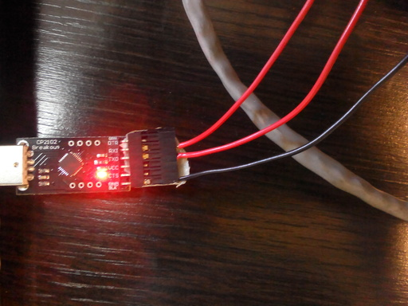
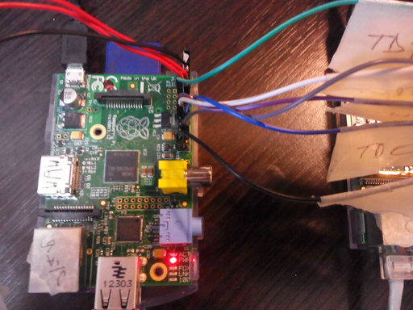
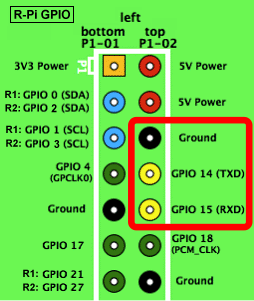
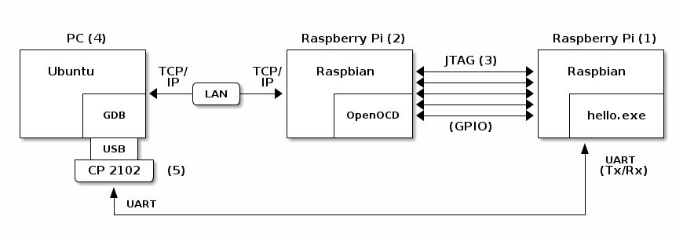

RTEMS sobre Raspberry Pi
========================

En esta sección se detalla como poder correr RTEMS en un equipo real. Dado que el objetivo final es estudiar RTEMS sobre una arquitectura ARM, se seleccionó a la Raspberry Pi (RPi) como el equipo de prueba.

La RPi es una "mini-computadora" de placa única que cuenta con todas las interfaces estándar para ser utilizada como una PC de escritorio (aunque con una capacidad de procesamiento y memoria reducida). La diferencia más importante con una PC es que no cuenta con disco rígido, el cual es suplantado por un lector de tarjetas SD. Está basada en un SoC (*System on a chip*, el BCM2835), un circuito integrado que reune los componentes más importantes de la computadora en un solo chip, incluyendo un microprocesador ARM (modelo ARM1176JZF-S).

En los próximos documentos se detalla paso a paso las configuraciones necesarias para llegar finalmente a un esquema de trabajo donde se tiene un RTEMS corriendo sobre la RPi, mientras que es depurado en forma remota por la PC de desarrollo. Dado que este esquema requiere bastante trabajo se lo dividió en distintas etapas, para ir controlando el progreso y correcto funcionamiento de los equipos y sus configuraciones.

Hay tres etapas principales: la primera es correr un sistema operativo común sobre la RPi (Raspbian). Luego poder instalar RTEMS, con uno de los programas de ejemplo (``hello``), monitoreando la salida del mismo para comprobar que funcione de forma correcta. Finalmente poder utilizar una interfaz de depuración de ARM (JTAG) de manera de no solo monitorear la salida del programa de RTEMS, sino también su funcionamiento interno, utilizando el depurador estándar GDB.

Se recomienda estudiar en detalle y probar todo lo documentado en esta sección, ya que cada etapa es necesaria para llegar al esquema final, y además, la configuración puede necesitar algunos ajustes con respecto a lo expuesto aquí, en base al modelo de la RPi, la versión de RTEMS, el programa de prueba, el ambiente de desarrollo, etc.

.. _rpi-raspbian:

Instalación del sistema operativo Raspbian
==========================================

El primer paso para verificar el correcto funcionamiento de la Raspberry Pi (RPi) y familiarizarse con la misma, es instalar un sistema operativo que posea interfaz gráfica para poder interactuar de una forma sencilla con la RPi. El sistema operativo seleccionado para esto es Raspbian (basado en el conocido Debian), siendo el más utilizado y recomendado como primera introducción a la RPi.

Para facilitar la instalación del mismo se utiliza el programa manejador de instalaciones llamado NOOBS, provisto por los desarrolladores de la RPi. Este programa inicia la RPi con una interfaz gráfica que permite de manera intuitiva elegir uno de varios sistemas operativos disponibles para instalar, encargándose de la mayoría de los detalles de instalación. El mismo se puede descargar de:

* http://www.raspberrypi.org/downloads/

Formato de la tarjeta SD
------------------------

Como se mencionó en la introducción la RPi no posee disco rígido, sino lector de tarjetas SD como dispositivo primario de almacenamiento de datos no volátiles, por lo que se debe instalar NOOBS en una SD, el cual se encargará de iniciar la RPi a un entorno gráfico para continuar la instalación del sistema operativo Raspbian. Para esto es necesario darle formato a la SD con una partición FAT32 como partición primaria, que es el único tipo de partición que reconoce la RPi para iniciar el sistema (luego pueden agregarse otras particiones de distinto tipo para almacenamiento de datos).

Para darle formato a la SD y prepararla para NOOBS se siguió el tutorial:

* http://qdosmsq.dunbar-it.co.uk/blog/2013/06/noobs-for-raspberry-pi/

Al igual que en otras secciones de este manual se supone que la PC de desarrollo está corriendo el sistema operativo Ubuntu (para otros sistemas las instrucciones a continuación podrían variar) y que obviamente tiene una lectora de tarjetas SD.

Luego de insertar la SD a la PC, el primer paso es reconocer la dirección asignada a la misma y proceder a editar su formato con la herramienta ``fdisk``.

.. code-block:: bash

    sudo fdisk -l # Lista la tabla de particiones.
    sudo fdisk /dev/mmcblk0

Una vez dentro del menú interactivo de ``fdisk`` se crea una partición FAT32, que es donde la Raspberry Pi busca los archivos de inicialización del sistema.

.. code-block:: bash

    p (print)
    d (delete: repetir hasta que no quede ninguna partición en la SD)
    n (new)
    p (partición primaria) (usar valores por defecto de número de partición y de sector)
    t (tipo)
    l (listar)
    b (W95 FAT32)
    w (escribir)

Fuera de ``fdisk``, con la partición primaria FAT32 creada, se procede a dar formato a la SD:

.. code-block:: bash

    # A la dirección de la SD se le agrega 'p1' indicando que es la primera partición
    sudo mkfs.vfat /dev/mmcblk0p1
    # Sincronización de la SD para asegurar que se hayan escrito todos los datos
    sudo sync

Una vez que la SD tiene el formato correspondiente, para instalar NOOBS en la misma solo es necesario descargarlo, descomprimirlo y copiar todos sus archivos directamente a la partición FAT32 creada en la SD. De esta manera la SD queda lista para ser insertada en la RPi y proceder a instalar el Raspbian.

Raspbian
--------

Antes de poder utilizar la RPi es necesario conectarle los periféficos básicos de entrada/salida. La RPi cuenta con dos puertos USB (esta cantidad puede variar según el modelo) por lo que pueden conectarse teclado y mouse USB, y posee salida HDMI para conectar un monitor (opcionalmente se puede conectar también un cable de red para que tenga acceso a internet).

Con los periféricos conectados y la SD insertada se puede encender la RPi, que mostrará primero el logo característico del equipo y luego aparecerá la interfaz gráfica de NOOBS. La misma es bastante intuitiva, no hacen falta mayores indicaciones, simplemente hay que elegir al sistema operativo Raspbian para su instalación.

Instalación básica de RTEMS
===========================

Una vez instalado Raspbian exitosamente y verificado el correcto funcionamiento de la RPi, se procede a probar la instalación de un programa de ejemplo de RTEMS en la misma.

Comunicación con RTEMS
----------------------

El *port* de RTEMS realizado para la RPi está documentado en:

* http://www.raspberrypi.org/forums/viewtopic.php?f=72&t=38962
* http://alanstechnotes.blogspot.com.ar/2013/03/rtems-on-raspberry-pi.html

Lo más importante a notar del mismo es que no soporta varias de las funcionalidades de RTEMS, a su vez RTEMS no soporta varios de los periféricos de la RPi, como por ejemplo la salida gráfica por HDMI. La interacción con RTEMS se realiza únicamente por consola, y el *port* de la RPi implenta la consola mediante la comunicación serie (UART) de la RPi.

Todo esto se traduce en que RTEMS, a diferencia del Raspbian instalado antes, no hace uso del teclado, mouse ni salida gráfica. La única interacción con el mismo, para saber si está funcionando correctamente o no, es mediante el puerto serie (UART) del que dispone la RPi.

CP2102
------

Para implementar la comunicación serie del lado de la PC de desarrollo (que en nuestro caso particular es una laptop) se utilizó el chip CP2102, que convierte las señales serie de transmisión y recepción (Tx/Rx) a USB, pudiendo conectarse directamente a la PC.

De utilizarse algún otro adapatador es importante tener en cuenta que la **RPi maneja una tensión de 3.3V, no 5V** que es la tensión más común, y que de ser aplicada directamente a la RPi (que no tiene protección de sobretensión) podría dañar la misma.

El tutorial seguido para realizar la conexión fue:

* http://www.sowbug.com/post/38918561276/serial-console-on-raspberry-pi

El chip CP2102 expone varias señales para implementar la transmisión serie, pero solo se utilizaron las señales básicas de transmisión (Tx), recepción (Rx) y tierra eléctrca (GND). Estas fueron conectadas a los pins correspondientes (de la bornera de 2x13 ubicada en la parte superior derecha de la foto) de la RPi:

El diagrama de pins de la RPi se encuentra en:

* http://elinux.org/RPi_Low-level_peripherals#General_Purpose_Input.2FOutput_.28GPIO.29

Los pins usados de la RPi son (según la numeración del diagrama): *Ground* (pin 6), TXD (pin 8) y RXD (pin 10). Con respecto al diagrama de pins, estos serían los de la columna derecha, del tercero al quinto, contando desde arriba hacia abajo. No hay que confundirlos con los dos primeros pins de la misma columna, que son de alimentación. Los pins de las señales de Tx/Rx tienen nombres alternativos (GPIO 14/15) que pueden ignorarse por ahora.

Es importante notar, como se señala en el tutorial, que **las señales de Tx/Rx deben conectarse en forma cruzada**, esto es, la señal de transmisión del CP2102 (Tx) debe conectarse con la señal de recepción de la RPi (RXD, pin 10), análogamente, la señal Rx del CP2102 debe conectarse a la señal Tx (pin 8) de la RPi. Las tierras eléctricas (GND) de los dos equipos deben conectarse juntas.

La tabla a continuación resume el conexionado:

+----------+------------------+
|  CP2102  |       RPi        |
+==========+==================+
|    TX    |   RXD  (pin 10)  |
+----------+------------------+
|    RX    |   TXD  (pin 8)   |
+----------+------------------+
|    GND   |  Ground (pin 6)  |
+----------+------------------+

Para iniciar la comunicación serie desde la PC se puede utilizar el programa ``minicom`` (o ``screen``) configurando el puerto con los parámetros especificados en:

* http://elinux.org/RPi_Serial_Connection#Console_serial_parameters

Una forma sencilla de comprobar la conexión y configuración es iniciar la RPi con Raspbian, conectarse por serie y verificar que se tenga acceso a una consola, provista por defecto por Raspbian, similar a como se muestra en el tutorial:

* http://bityard.blogspot.com.ar/2012/06/raspberry-pi-serial-console-in-linux.html

Por ejemplo con el comando:

.. code-block:: bash

    sudo screen /dev/ttyUSB0 115200

Prueba
------

Una vez que la comunicación serie funciona correctamente se procede a probar RTEMS en la RPi con el ejemplo ``hello``. Para esto es necesario compilar el ejemplo para ARM, específicamente para el BSP de la RPi. Los pasos son los mismos que los descritos en documentos anteriores, cuando se emulaba RTEMS compilándolo para x86, solo que hay que cambiar los argumentos de configuración para indicar la arquitectura y BSP de interés. Esto se explica en un ejemplo hecho por el autor del *port* de RTEMS a RPi:

* http://alanstechnotes.blogspot.com.ar/2013/03/compiling-and-installing-rtems-for.html

El mecanismo es el mismo, solo que se debe crear una carpeta distinta para el BSP de la RPi (``b-rpi`` en el ejemplo) y configurarla con el comando:

.. code-block:: bash

    cd ~/development/rtems/src/rtems-source-builder/rtems
    ../source-builder/sb-set-builder --log=l-arm.txt \
        --prefix=$HOME/development/rtems/4.11 4.11/rtems-arm

    mkdir -p ~/development/rtems/bsps
    cd ~/development/rtems/bsps
    mkdir b-rpi
    cd b-rpi
    ../../src/git/rtems/configure --target=arm-rtems4.11 \
    --enable-rtemsbsp=raspberrypi \
    --enable-tests=samples \
    --enable-networking \
    --enable-posix \
    --enable-rtems-debug
    make all

La diferencia de este comando con el que está en el ejemplo del link es la dirección de ``configure`` y que se agrego la posibilidad de depurar con el argumento ``--enable-rtems-debug``. Se puede observar cómo se indica la arquitectura ARM en el argumento ``--target=arm-rtems4.11`` y la RPi como BSP en el argumento ``--enable-rtemsbsp=raspberrypi``. Además, como en el ejemplo introductorio para i386, se instalan las herramientas de desarrollo necesarias para realizar la compilacion para ARM, provistas por el Source Builder.

Con la configuración realizada, se compila normalmente con el comando ``make all``, para obtener, entre otros, el ejemplo ``hello.exe``.

Para iniciar la RPi esta necesita tener una partición primaria FAT32 con una serie de archivos dentro de la misma, que contienen la configuración básica junto con la imagen del sistema operativo a ejecutar. Para simplificar el trabajo se puede reutilizar la SD con el Raspbian instalado, reemplazando la imagen del mismo, almacenada en el archivo ``kernel.img`` de la partición FAT32, con la de RTEMS. Se recomienda hacer un *backup* del Raspbian antes, ya que en la configuración final de trabajo serán necesarias dos SD, una con Raspbian y otra con RTEMS.

Alternativamente, para no reutilizar la SD con el Raspbian, se puede dar formato a una segunda SD (como se explico anteriormente) y copiar dentro de ella los archivos de:

* https://github.com/raspberrypi/firmware/tree/master/boot

Reemplazando, como se dijo antes, el archivo ``kernel.img`` con el de RTEMS.

La imagen de RTEMS se obtiene extrayendo el binario de un programa de RTEMS compilado (en este caso el ejemplo ``hello.exe``) a la partición FAT32 de la SD, sobreescribiendo el archivo ``kernel.img``:

.. code-block:: bash

    arm-rtems4.11-objcopy -Obinary \
        $HOME/development/rtems/bsps/b-rpi/arm-rtems4.11/c/raspberrypi/testsuites/\
        samples/hello/hello.exe /media/1C48-058F/kernel.img

El comando listado extrae el binario del ejecutable compilado (``hello.exe``) y lo almacena (con el nombre ``kernel.img``) en la partición FAT32 de la SD (que en este caso particular tenía la dirección ``/media/1C48-058F`` montada automáticamente por Ubuntu).

Al iniciar la RPi con este ejemplo se debería poder observar por serie la misma salida que se observó cuando se emulaba RTEMS:

.. code-block:: bash

    *** HELLO WORLD TEST ***
    Hello World
    *** END OF HELLO WORLD TEST ***

.. _rpi-jtag:

Depurar RTEMS en una Raspberry Pi a través de JTAG
==================================================

El objetivo de esta sección es poder ejecutar y depurar RTEMS corriendo en una Raspberry Pi (RPi) en forma remota, de manera de tener en la PC de desarrollo un GDB que esté interactuando con la RPi para poder examinar cómo funciona RTEMS por dentro.

Los microprocesadores de ARM implementan un protoclo de comunicación denominado JTAG que permite depurar el funcionamiento del micro a nivel de instrucción. La RPi expone estos pins de su micro ARM (ARM1176) por lo cual un dispositivo que implemente el protocolo JTAG (llamado *JTAG dongle*) puede interactuar con el micro controlando su funcionamiento interno.

Dado que estos dispositivos tienen un precio elevado, y en algunos casos son difíciles de conseguir, se implementó dicha funcionalidad en una segunda RPi, para que sirva de intermediaria entre el protocolo JTAG y el de GDB, de manera de poder depurar RTEMS desde la PC de desarrollo con GDB de manera transparente.

La configuración de trabajo quedó entonces como se muestra en la figura a continuación:

En el extremo derecho de la figura (1) se muestra el ejemplo ``hello`` de RTEMS corriendo en una RPi, este es el que se denomina *target* (objetivo) de depuración, es el programa que se quiere controlar y depurar para examinar su funcionamiento interno.

En el extremo izquierdo de la figura (4) se muestra la PC de desarrollo, donde se ejecuta GDB para poder depurar el programa de RTEMS mencionado.

En el medio de ambas se muestra una segunda RPi (2) que permitirá la comunicación entre GDB y RTEMS. En esta RPi se instaló un Raspbian, y dentro del mismo se instaló el programa OpenOCD. Este programa implementa el protoclo JTAG (3) para controlar el micro ARM que ejecuta RTEMS (1) y a su vez expone un servidor al que puede conectarse el GDB de la PC de desarrollo (4) para depurar RTEMS. El GDB se conecta al servidor de OpenOCD a través de una red local (ya que la RPi tiene un conector Ethernet y el Raspbian implementa TCP/IP).

Todas las conexiones mencionadas componen lo que se podría denominar el canal de depuración. Por otro lado, el programa de RTEMS tiene habilitada la consola, que está implementada a través del puerto serie de la RPi (UART). Este puerto está conectado a la PC de desarrollo a través del chip CP2102 (5) que convierte la señal serie (UART) a USB para conectarlo a la PC, su configuración fue descrita en el documento anterior. Esto permite por un segundo canal (de ejecución) monitorear la salida del programa de RTEMS.

En una sesión común de GDB, cuando se depura un programa local, corriéndo en la misma máquina, interactuando por consola, puede observarse la salida del programa directamente en la interfaz de GDB. Este no es el caso aquí, dado que GDB no interactúa a través de la consola sino meditante JTAG, y leyendas como "hola mundo" del programa ``hello.exe`` no podrán observarse dentro de GDB, solo a través de la conexión serie (5), por esto en necesario mantenerla también en esta configuración.

A continuación se muestra una imagen de cómo quedó la configuración final. La RPi de la izquierda es la que corre RTEMS (1) conectada a la PC (4) a través de la conexión serie (5) y la RPi de la derecha está corriendo OpenOCD (2) conectada a la PC a través de una red local. Ambas RPi están conectadas entre sí mediantes los pins que corresponden a las señales de JTAG (3).

Una opción alternativa a todo lo descrito antes era implementar un servidor de GDB (*GDB Stub*) dentro de RTEMS. Algo que se observó que estaba hecho para x86 pero no para ARM y hubiera involucrado demasiado desarrollo de código acoplado al de RTEMS, lo que no resultaba práctico en esta etapa del proyecto.

Configuración de la Raspberry Pi (2) como adaptador JTAG
--------------------------------------------------------

El siguiente link es la primera referencia que se encontró donde se sugería utilizar una RPi como adaptador JTAG. De todas formas resultó ser bastante distinto de lo que se necesitaba, sin embargo, la instalación del OpenOCD se basó parcialmente en el mismo.

* https://github.com/synthetos/PiOCD/wiki/Using-a-Raspberry-Pi-as-a-JTAG-Dongle

El primer paso es instalar un Raspbian como ya fue documentado antes. Luego, una vez iniciado el mismo, se instala OpenOCD, que hará de intermediario entre los protocolos de JTAG y GDB:

.. code-block:: bash

    sudo apt-get update
    # Se instalan las dependencias de OpenOCD
    sudo apt-get install -y autoconf libtool libftdi-dev texinfo git
    # Se baja el repo para compilarlo desde los fuentes
    git clone --recursive git://git.code.sf.net/p/openocd/code openocd-git
    cd openocd-git
    ./bootstrap
    ./configure --enable-sysfsgpio --enable-maintainer-mode --enable-arm-jtag-ew \
        --enable-dummy --enable-buspirate --prefix=/usr
    make
    sudo make install

Es importante incluir el parámetro ``--enable-sysfsgpio`` en la configuración de OpenOCD, para que incluya en la instalación la implementación necesaria poder manejar los pins de la RPi (GPIO).

OpenOCD necesita un *script* de configuración para saber qué interfaz está utilizando para conectarse al *target* de depuración, o sea, para poder interactuar con el *hardware* donde está instalado y saber cómo configurarlo para utilizarlo como un adaptador JTAG. En este caso la interfaz (donde está corriendo) es una RPi, y su *script* de configuación ya está incluido en la instalación (``interface/sysfsgpio-raspberrypi.cfg``).

Además del ya mencionado, es necesario otro *script* de configuración para saber cómo interactuar con el *target* de depuración, en este caso otra RPi, que no está incluido en la instalación, por lo que habrá que crearlo. Se usó como base el *script* encontrado en el tutorial:

* http://sysprogs.com/VisualKernel/tutorials/raspberry/jtagsetup/

Se crea el *script* en la dirección ``/usr/share/openocd/scripts/target/raspberry.cfg`` (suponiendo que se instaló OpenOCD en la dirección por defecto) con el contenido:

.. code-block:: bash

    adapter_khz 1000
    adapter_nsrst_delay 400
    reset_config none

    if { [info exists CHIPNAME] } {
    set _CHIPNAME $CHIPNAME
    } else {
    set _CHIPNAME rspi
    }

    if { [info exists CPU_TAPID ] } {
    set _CPU_TAPID $CPU_TAPID
    } else {
    set _CPU_TAPID 0x07b7617F
    }

    jtag newtap $_CHIPNAME arm -irlen 5 -expected-id $_CPU_TAPID

    set _TARGETNAME $_CHIPNAME.arm
    target create $_TARGETNAME arm11 -chain-position $_TARGETNAME
    rspi.arm configure -event gdb-attach { halt }

Lo más importante para resaltar del *script* es que se indica el tipo de micro ARM que utiliza la RPi y la velocidad del reloj que se utiliza en la comunicación JTAG.

Conexión (3) entre la RPi que corre RTEMS (1) y la RPi que se utiliza como adaptador JTAG (2)
---------------------------------------------------------------------------------------------

Esta es la parte más importante de todo el proceso, porque hay que tener mucho cuidado de no conectar incorrectamente algunos de los pins GPIO, pudiendo dañar las RPi.

Las dos RPi se conectarán a través de los pins GPIO (pins de entrada y salida de propósito general), aunque corresponde hacer una aclaración. La RPi que corre OpenOCD (2) utilizará los pins en su función de propósito general (GPIO), usándolos como entradas y salidas comunes, que luego serán interpretadas por OpenOCD según el estándar JTAG, para implementar su funcionalidad como adaptador. La RPi que corre RTEMS (1) en cambio, utilizará estos pins en otro modo (no GPIO), sino que expondrá a través de estos las conexiones JTAG del micro ARM. Se podría pensar que en el primer caso se está comunicando con el controlador de los pines que provee la RPi, mientras que en el segundo se está comunicando directamente con el micro ARM dentro de la RPi. Visualmente, de todas formas, se observará que la conexión física se realiza a la misma sección de pins, lo que cambia es la funcionalidad lógica de los mismos.

Las distintas señales de la interfaz JTAG están descriptas aquí:

* http://infocenter.arm.com/help/index.jsp?topic=/com.arm.doc.dui0499b/BEHEIHCE.html

De todas estas, OpenOCD utiliza: TCK, TMS, TDI, TDO, TRST. Todas estas son accesibles a través de la RPi.

La RPi (1), como ya se mencionó, expone estas señales en los pins GPIO, los cuales hay que configurar para que implementen esta funcionalidad, que no está habilitada por defecto (más adelante en el documento se explicará como hacer esto). El diagrama más confiable de los pins GPIO se encontró en:

* http://elinux.org/RPi_Low-level_peripherals#General_Purpose_Input.2FOutput_.28GPIO.29

Las RPi utilizadas son el modelo B revisión 2.0, en el diagrama se ve que algunos GPIO varían según la revisión 1.0 o 2.0. Esta revisión se puede descubrir según lo que se explica en los primeros puntos de este tutorial (aunque también suele indicarse sobre la misma placa de la RPi):

* http://sysprogs.com/VisualKernel/tutorials/raspberry/jtagsetup/

Conexión del lado de la RPi que corre OpenOCD (2)
~~~~~~~~~~~~~~~~~~~~~~~~~~~~~~~~~~~~~~~~~~~~~~~~~

En el *script* de configuración de la interfaz de OpenOCD (mencionado antes, que ya estaba incluido en la instalación) indica qué pins GPIO de la RPi (2) utilizará para comunicarse con las señales de JTAG expuestas por la otra RPi (1). Este *script* se encuentra en ``/usr/share/openocd/scripts/interface/sysfsgpio-raspberrypi.cfg`` (suponiendo nuevamente que se utilizó la dirección de instalación por defecto). Se observó el contenido:

.. code-block:: bash

    # Each of the JTAG lines need a gpio number set: tck tms tdi tdo
    # Header pin numbers: 23 22 19 21
    sysfsgpio_jtag_nums 11 25 10 9

    # At least one of srst or trst needs to be specified
    # Header pin numbers: TRST - 26, SRST - 18
    sysfsgpio_trst_num 7
    # sysfsgpio_srst_num 24

Los dos párrafos muestran qué pin debe conectarse a qué señal de JTAG. Se utilizan generalmente dos formas de referirse a un pin de la RPi, las cuáles es importante diferenciarlas correctamente.

Por un lado está la **dirección física**: el número de pin en la hilera de 2x13 pins en la placa de la RPi, contando de izquierda a derecha y de arriba a abajo, ubicando la RPi de forma tal que la hilera de pins quede ubicada arriba a la derecha. Por otro lado está la **dirección lógica**: el número de GPIO según la numeración lógica determinada por la RPi, con el cual se hace referencia al pin en el *firmware*. **LA DIRECCIÓN LÓGICA DE GPIO NO SE CORRESPONDE CON EL NÚMERO FÍSICO DEL PIN**.

En el primer párrafo se ve en la primera línea el nombre de las señales de JTAG a las que debe conectarse el OpenOCD. En la segunda se listan las ubicaciones físicas de los pins que deben conectarse a estas señales (en el mismo orden). En la tercera se listan los mismo pins pero según su dirección lógica.

Por ejemplo, según lo visto en el *script*, la señal TCK de JTAG deberá conectarse al pin físicamente ubicado en la posición 23 (dirección física), que a su vez corresponde al GPIO número 11 (dirección lógica).

En forma similar, en el segundo párrafo está, en la segunda línea la dirección física (26) del pin que se conectará a la señal TRST de JTAG, y en la tercer línea su dirección lógica (7). La señal SRST no se utiliza (está comentada en el *script*) dado que la RPi no expone esta señal del micro ARM.

Con el diagrama del GPIO se pudo corroborar que coincidieran las direcciones físicas y lógicas de cada pin listado en el *script* de configuración de la interfaz del OpenOCD.

Conexión del lado de la RPi que corre RTEMS (1)
~~~~~~~~~~~~~~~~~~~~~~~~~~~~~~~~~~~~~~~~~~~~~~~

Las señales de JTAG no están expuestas por defecto en los pins de la RPi, por lo tanto es necesario realizar la configuración necesaria para que esto suceda. La descripción precisa de los pins GPIO y el resto de los periféricos de la RPi se encuentran en la documentación del chip BCM2835 (que incluye tanto el micro de ARM como sus periféricos):

* http://www.raspberrypi.org/documentation/hardware/raspberrypi/bcm2835/BCM2835-ARM-Peripherals.pdf

Como se observa en la primer figura del documento, que muestra el diagrama del espacio de memoria del chip, para configurar cualquier periférico (incluidos los pins que resultan de interés aquí) es necesario acceder y modificar posiciones específicas de memoria (denominadas registros), que no están vinculadas directamente a la memoria RAM, sino a los controladores de los distintos periféricos disponibles.

Cada pin de la RPi puede implementar distintas funcionalidades, además de la función básica de entrada/salida genérica (GPIO). En la sección ``6.2 Alternative Function Assignments`` del documento se listan los pins GPIO y sus distintas funciones disponibles para cada uno. Se puede observar que en los modos alternativos 4 y 5 algunos pins muestran la funcionalidad de JTAG, los que comienzan con ``ARM_``. Por ejemplo, en la fila del GPIO26 (siendo 26 la dirección lógica del pin), bajo la columna de la función alternativa 4 (ALT4), se encuentra la señal TDI de JTAG, listada como ``ARM_TDI``.

En la sección ``6.1 Register View`` se muestran los distintos registros (direcciones de memoria) que controlan a los GPIO. Es importante notar que las direcciones listadas son las vistas por la GPU, pero no son las mismas que las que ve el micro ARM. Básicamente, se debe cambiar el principio de las direcciones ``0x7Exxxxxx`` del documento por ``0x20xxxxxx`` (el resto, las 'x', quedan igual) para ser accedidos por el micro ARM.

Para entender cómo exponer correctamente las señales de JTAG se estudió el trabajo del siguiente repositorio:

* https://github.com/dwelch67/raspberrypi/tree/master/armjtag

El ``README`` del repositorio explica cómo poder depurar un programa corriendo en RPi con JTAG habilitado. Para esto provee un programa (``armjtag.bin`` y su código fuente ``armjtag.c``) que modifica los registros correspondientes. Aunque no se probó este programa se estudió su código fuente para entender cómo modificar los registros (direcciones de memoria) apropiados para exponer las señales de JTAG a través de los pins de la RPi. Se puede apreciar un extracto del mismo a continuación:

.. code-block:: c

    ra=GET32(GPFSEL2);
    ra&=~(7<<6); //gpio22
    ra|=3<<6; //alt4 ARM_TRST
    ra&=~(7<<12); //gpio24
    ra|=3<<12; //alt4 ARM_TDO
    ra&=~(7<<15); //gpio25
    ra|=3<<15; //alt4 ARM_TCK
    ra&=~(7<<21); //gpio27
    ra|=3<<21; //alt4 ARM_TMS
    PUT32(GPFSEL2,ra);

El código es muy sencillo y se observa que básicamente lee posiciones de memoria, modifica algún bit y las vuelve a almacenar, o sea, modifica bits de los registros de configuración. Por ejemplo, el registro ``GPFSEL2``, es una dirección de memoria que guarda la configuración que determina qué funciones van a adoptar los GPIO 20-29 (direcciones lógicas), las cuales se encuentran codificadas en los distintos bits de este registro (de 32 bits de tamaño).

La funcionalidad del pin GPIO 22, por ejemplo, se ubica entre la posición de los bits 6 y 8 del registro (siendo 0 el bit menos significativo). El programa escribe ahí un 3 (``ra|=3<<6;``), o sea, ``011`` en binario, que habilita la función alternativa 4 del pin. Para el GPIO 22, la función alternativa 4 expone la señal TRST de JTAG (algo que se puede corroborar en la seccíón 6.2 del documento).

Estudiando el código completo se pudo determinar qué pins GPIO y en qué función era necesario utilizar para habilitar todas las señales de JTAG (listados en la próxima sección).

En el código se indicaba conectar la señal TRST a Vcc (3.3v), pero se obvió esta indicación y se conectó esta señal a la RPi con OpenOCD (como con el resto de las señales). Esto se hizo así siguiendo la sugerencia del tutorial:

* http://dynazu.blogspot.com.ar/2013/08/hard-disk-hack-part-1.html

Conexión final
~~~~~~~~~~~~~~

Juntando toda la información anterior se confeccionó la conexión final entre las dos RPi. La primera columna indica la señal de JTAG. Luego se muestran las direcciones lógicas y físicas de los pins correspondientes para la RPi con OpenOCD (2) y finalmente las direcciones físicas y lógicas de los pins en el RPi con RTEMS (1).

+-----------+-----------------------+-----------------------+
|   JTAG    |        OpenOCD        |         RTEMS         |
+===========+===========+===========+===========+===========+
|           |     L     |     P     |     P     |     L     |
+-----------+-----------+-----------+-----------+-----------+
|    TCK    |     11    |     23    |     22    |     25    |
+-----------+-----------+-----------+-----------+-----------+
|    TMS    |     25    |     22    |     13    |     27    |
+-----------+-----------+-----------+-----------+-----------+
|    TDI    |     10    |     19    |      7    |      4    |
+-----------+-----------+-----------+-----------+-----------+
|    TDO    |      9    |     21    |     18    |     24    |
+-----------+-----------+-----------+-----------+-----------+
|    TRST   |      7    |     26    |     15    |     22    |
+-----------+-----------+-----------+-----------+-----------+
|    GND    |           |     25    |     25    |           |
+-----------+-----------+-----------+-----------+-----------+

Hay que notar que se invierte en las útlimas columnas el orden de las direcciones físicas y lógicas, de manera que quede en el centro de la tabla, columnas 3 y 4, los pins físicos de cada RPi que hay que conectar entre sí para cada señal de JTAG. Esto quiere decir que se debe conectar, por ejemplo, el pin físico 23 de la RPi con OpenOCD (2) al pin físico 22 de la RPi con RTEMS (1), correspondientes a la señal de TCK.

A la lista de señales se agrego el GND (tierra eléctrica) para que las dos RPi tengan las mismas referencias de tensión (este pin no pertenece a los GPIO por lo que no tiene dirección lógica, solo dirección física en el diagrama).

Modificación de RTEMS para habilitar JTAG
-----------------------------------------

Como se mencionó antes, las señales de JTAG no están expuestas por defecto en la RPi. El código que sea ejecutado en la RPi a depurar es el encargado de habilitarlas, como se hace en el archivo ``armjtag.c`` del ejemplo anterior. En el caso de RTEMS este código no está incluido (por ahora) en el *port* de la RPi, por lo que debe ser incluido manualmente. En este caso se incluyó una versión modificada de ``armjtag.c`` en la función ``bsp_start`` del *port* de la RPi, que se ejecuta al inicio de RTEMS y realiza todas las inicializaciones relacionadas con el BSP (la RPi). Esta función se encuentra en el archivo ``c/src/lib/libbsp/arm/raspberrypi/startup/bspstart.c`` y en el caso de la RPi se encarga de inicializar las interrupciones que soporta la misma. El *patch* con este código se encuentra en ``misc/bspstart.c.jtag.patch`` dentro de esta documentación y debe ser aplicado al código fuente de RTEMS.

.. code-block:: bash

    cd ~/development/rtems/src/git/rtems
    git apply  $HOME/rtems-project/misc/bspstart.c.jtag.patch

    cd ~/development/rtems/bsps/b-rpi
    # Si el archivo ya existe rtems no lo vuelve a buildear incluso si cambiaron los fuentes
    rm -f $HOME/development/rtems/bsps/b-rpi/arm-rtems4.11/c/raspberrypi/testsuites/\
        samples/hello/hello.exe
    make all

    arm-rtems4.11-objcopy -Obinary \
        $HOME/development/rtems/bsps/b-rpi/arm-rtems4.11/c/raspberrypi/testsuites/\
        samples/hello/hello.exe /media/1C48-058F/kernel.img

En la práctica los programas se cargan en la RPi en forma remota a través de JTAG. Pero como no está habilitado por defecto cuando se prende la RPi, el primer programa se cargará de la SD, este será el encargado de habilitar JTAG. Luego nuevas versiones del programa a depurar pueden cargarse remotamente en la misma sesión de GDB. Por lo tanto, la SD no necesita tener el último programa actualizado a depurar, solamente una versión que habilite JTAG, para luego cargar remotamente la versión de interés a depurar.

Uso de OpenOCD
--------------

Una vez instalado OpenOCD y conectadas las dos RPi se puede probar que funcione correctamente el canal de depuración. Para esto es necesario iniciar OpenOCD en la RPi (2). Para mayor comodidad se conecta la PC de desarrollo (4) a la RPi por ``ssh`` (mediante una red local que compartan ambos) de manera de controlar todo desde la PC, aunque la RPi cuenta con todo el *hardware* necesario para ser manipulada directamente (puede conectarse un teclado y un monitor). Como se aclaró antes, es necesario también tener corriendo un RTEMS en la RPi a depurar (1) que habilite JTAG.

Una vez conectada la PC a la RPi (2) se puede iniciar OpenOCD (dentro de la RPi), indicando los *scripts* de configuración, tanto para la interfaz como para el *target* de depuración (ambos RPi), con el comando:

.. code-block:: bash

    sudo openocd -f interface/sysfsgpio-raspberrypi.cfg -f target/raspberry.cfg

Si se inicia correctamente y detecta la interfaz JTAG de la RPi corriendo RTEMS (1), mostrará una salida similar a la siguiente:

.. code-block:: bash

    pi@raspberrypi ~ $ sudo openocd -f interface/sysfsgpio-raspberrypi.cfg \
        -f target/raspberry.cfg -f board/raspberry.cfg
    Open On-Chip Debugger 0.9.0-dev-00098-ge03eb89 (2014-07-30-15:43)
    Licensed under GNU GPL v2
    For bug reports, read
        http://openocd.sourceforge.net/doc/doxygen/bugs.html
    Info : only one transport option; autoselect 'jtag'
    SysfsGPIO nums: tck = 11, tms = 25, tdi = 10, tdo = 9
    SysfsGPIO num: trst = 7
    trst_only separate trst_push_pull
    jtag_ntrst_delay: 400
    adapter speed: 1000 kHz
    trst_only separate trst_push_pull
    Info : SysfsGPIO JTAG bitbang driver
    Info : This adapter doesn't support configurable speed
    Info : JTAG tap: RPi.arm tap/device found: 0x07b7617f (mfg: 0x0bf, part: 0x7b76, ver: 0x0)
    Info : found ARM1176
    Info : RPi.arm: hardware has 6 breakpoints, 2 watchpoints

Donde la línea más importante es la anteúltima (``Info : found ARM1176``) indicando que reconoció correctamente el micro ARM de la RPi a depurar.

Carga y depuración remota de RTEMS
----------------------------------

Con las dos RPi conectadas y JTAG funcionando correctamente es posible cargar y depurar programas remotamente utilizando GDB desde la PC de desarrollo (4) interactuando únicamente con la RPi que corre OpenOCD (2), la cual es la encargada de interpretar los comando de GDB y ejecutarlos a través de la comunicación JTAG con la RPi que corre RTEMS (1).

Para esto se conecta por red a la PC (4) con la RPi que corre OpenOCD (2). A partir de acá el hecho de estar depurando RTEMS resulta transparente y se trabaja como una sesión de depuración normal de GDB. Desde la PC se inicia GDB con el programa que se desea cargar/depurar como argumento (en este caso el ejemplo ``hello.exe``) y dentro de GDB :

.. code-block:: bash

    arm-rtems4.11-gdb $HOME/development/rtems/bsps/b-rpi/arm-rtems4.11/c/raspberrypi/\
        testsuites/samples/hello/hello.exe
    target remote <ip_rpi>:3333

El programa debe haber sido compilado con la información de depuración (como se mostró en el documento anterior). La IP ``<ip_rpi>`` corresponde a la IP de la RPi donde se corre OpenOCD (2), el puerto 3333 es el que utiliza por defecto OpenOCD para la conexión GDB, pero se puede cambiar en la configuración.

Una vez conectado el GDB se procede a cargar y ejecutar el programa en forma remota con los comandos:

.. code-block:: bash

    load
    continue

Si el programa se cargó correctamente se verá una salida similar a:

.. code-block:: bash

    Loading section .start, size 0x1e4 lma 0x8000
    Loading section .text, size 0x19314 lma 0x81e8
    Loading section .init, size 0x18 lma 0x214fc
    Loading section .fini, size 0x18 lma 0x21514
    Loading section .rodata, size 0x1488 lma 0x100000
    Loading section .ARM.exidx, size 0x8 lma 0x101488
    Loading section .eh_frame, size 0x48 lma 0x101490
    Loading section .init_array, size 0x4 lma 0x1014d8
    Loading section .fini_array, size 0x4 lma 0x1014dc
    Loading section .jcr, size 0x4 lma 0x1014e0
    Loading section .data, size 0x610 lma 0x1014e8
    Start address 0x8040, load size 110620
    Transfer rate: 6 KB/sec, 2989 bytes/write.

Como se explicó en el documento anterior la salida del programa por consola no se visualizará dentro de GDB como un programa depurado localmente, sino que se podrá visualizar únicamente por la comunicación serie (5), establecida directamente entre la PC (4) y la RPi que corre RTEMS (1).
