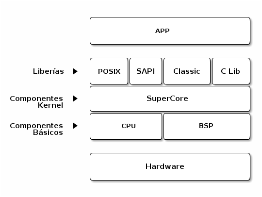

Estructura
==========

RTEMS está compuesto de diversos módulos (o componentes) cada uno de los cuales provee una funcionalidad concreta. A grandes rasgos, se pueden distinguir tres capas en las que se engloban los distintos módulos. La primera, compuesta por los módulos **CPU** y **BSP** (*Board Support Package*), interactúa con el hardware y brinda una interfáz común a la capa superior. La segunda, formada por el módulo **SuperCore**, contienen toda la funcionalidad del *kernel* que es independiente de la arquitectura subyacente. En la última se sitúan las distintas librerías que son utilizada por las aplicaciones que se ejecutan sobre RTEMS.

El diagrama a continuación muestra como se ubican las capas y los módulos dentro de ellas. La comunicación se realiza de forma **vertical** y **adyacente**, es decir, un módulo utiliza los servicios que ofrece los modúlos de la capa
inferior. Por ejemplo, la API POSIX utiliza los servicios provistos por SuperCore.

.. note::
    El relevamiento del código de RTEMS fue hecho sobre el commit ``e5274df1d958a3252dcf3b56b4330047aea552fa``. Para trabajar sobre esta versión particular se puede hacer los siguiente: ``git checkout -b auditing e5274df1d958a3252dcf3b56b4330047aea552fa``.

.. note::
    El diagrama fue generado a partir del relevamiento del código fuente.

Módulos:

* **CPU**: Contiene funcionalidad que es **dependiente** del modelo de CPU pero no del *board* utilizado.

* **BSP** (*Board Support Package*): Contiene funcionalidad que interactúan con el *board*.

* **SuperCore**: Contiene componentes de *kernel* **independientes** de la arquitectura sobre la cual se ejecuta RTEMS.

* **Librerías**: POSIX, SAPI, Classic, C Lib.

Estrutura de directorios
------------------------

RTEMS está preparado para poder ser compilado para distintos procesadores y
distintas *target boards*. La estructura de directorios refleja
esto. Los más importantes son:

* ``${RTEMS_ROOT}/c/``

    * Tiene el código que **debe** ser **adapatado** para cada modelo de procesador y BSP.

* ``${RTEMS_ROOT}/cpukit/``

    * Tiene código que es **independiente** del modelo de procesador y BSP.

    * Puede ser compilado como una librería de C.

    * Contiene el código para la mayor parte de los sevicios que ofrece RTEMS.

${RTEMS_ROOT} es el *path* del repositorio principal de RTEMS (``git://git.rtems.org/rtems.git``).

Directorio ``c``
^^^^^^^^^^^^^^^^

Los subdirectorios más relevantes dentro de ``c`` son los siguientes:

* ``${RTEMS_ROOT}/c/src/ada/``

    * *Bindings* de Ada95 para la API Classic de RTEMS.

* ``${RTEMS_ROOT}/c/src/lib/``

    * Contiene los directorios ``libbsp/`` y ``libcpu`` que tienen el código para cada BSP y cada modelo de CPU soportado en RTEMS.

    * Cada subdirectorio está organizado por familia de procesador y *board*.

* ``${RTEMS_ROOT}/c/src/libchip/``

    * Contiene los *drivers* de los periféricos que son **dependientes** del CPU y *board*. Por ejemplo, dispositivos seriales, controladores de interfaces de red, memoria compartida y relojes de tiempo real.

* ``${RTEMS_ROOT}/c/src/librtems++/``

    * Contiene clases de C++ que se mapean a la API Classic de RTEMS.

Directorio ``cpukit``
^^^^^^^^^^^^^^^^^^^^^

Este directorio contiene diferentes librerías implementadas para RTEMS. Entre
ellas, *networking*, *zlib*, servidor *telnet*, servidor *http*, etc. Además,
contiene los siguientes subdirectorios:

* ``${RTEMS_ROOT}/cpukit/posix/``

    * Contiene la implementación Thread de la API POSIX de RTEMS.

*  ``${RTEMS_ROOT}/cpukit/rtems/``

    * Contiene la implementación de la API Classic de RTEMS.

*  ``${RTEMS_ROOT}/cpukit/sapi/``

    * Contiene la implementación de la API SAPI de RTEMS.

* ``${RTEMS_ROOT}/cpukit/score/``

    * Implementa **SuperCore** de RTEMS. Todas las APIs (Classic, POSIX y SAPI) usan lo provisto por este módulo.

    * El subdirectorio ``score/cpu`` contiene código **dependiente** de cada modelo de CPU.
