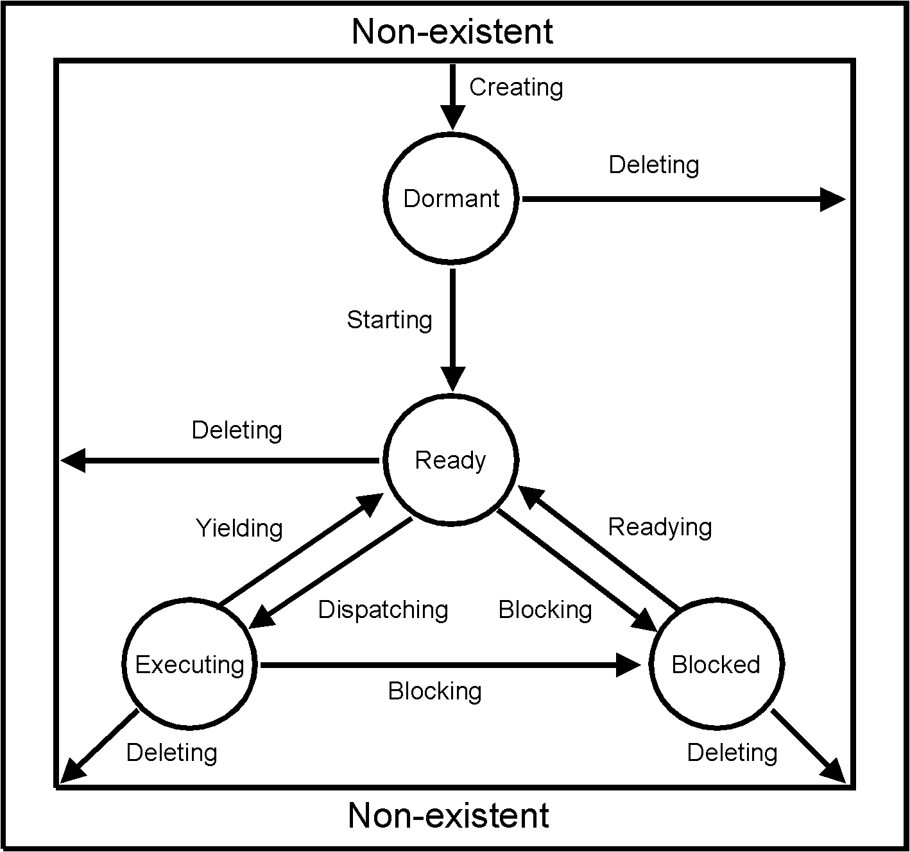

.. _thread-scheduling:

Planificación de *Threads*
==========================

Para estudiar la planificación se tomó como ejemplo el funcionamiento del *scheduler* más simple: **Deterministic Priority Scheduler** (DPS, planificador determinístico en base a prioridad), que toma solo en cuenta el valor de prioridad asignado a un *thread*.

Introducción
------------

El DPS es el *scheduler* por defecto en RTEMS. Ordena los *threads*, denominados *tasks* en RTEMS, según la prioridad en forma determinística (en forma fija y predecible). Según la documentación de RTEMS:

	*Priority based scheduling algorithms will always select the highest priority task that is ready to run when allocating the processor to a task.*

Hay 255 prioridades, siendo 255 la prioridad más baja y 1 la prioridad más alta. La prioridad 0 se reserva únicamente para *threads* internos.

Se implementa utilizando un *array*, de 255 elementos, donde cada uno contiene una lista (*chain*) FIFO (*First In First Out*) con todas las tareas con la misma prioridad correspondiente a esa posición. Además de este *array* se encuentra un *bitmap* (mapa de bits, con una implementación dependiente de la arquitectura) para señalar que posiciones en el *array* contienen listas no vacías, o sea, tareas en estado *READY* para esa prioridad, de manera de agilizar la búsqueda de la tarea que tenga la mayor prioridad.

En todo momento hay un *thread* ejecutando (``_Thread_Executing``) y un *heredero* (``_Thread_Heir``), que representa el próximo *thread* a ejecutar (al hacer el próximo *dispatch* de *threads*) y puede hacer referencia al mismo *thread* que se está ejecutando (por ejemplo, en el caso de que haya un solo *thread* de mayor prioridad a todo el resto). El despacho de los *threads* se realiza fuera del *scheduler* y es dependiente de la arquitectura.

Objetos Básicos
---------------

La actual modularización del mecanismo de planificación permite que pueden haber distintos planificadores funcionando en simultáneo para varios procesadores, pensando en una arquitectura SMP (de múltimples procesadores). Por ahora se asume procesador único, por ende la macro ``_Per_CPU_Get()`` que accede a distintos parámetros de un procesador particular se va a ignorar, suponiendo que siempre hace referencia a la misma estructura (el procesador único).

Una instancia del *scheduler* (y por ahora se supone que no hay más de una) se representa con la estructura ``Scheduler_Control``.

.. code-block:: c
   :caption: cpukit/score/include/rtems/score/scheduler.h

	/**
	 * @brief Scheduler control.
	 */
	struct Scheduler_Control {
	  /**
	   * @brief Reference to a statically allocated scheduler context.
	   */
	  Scheduler_Context *context;

	  /**
	   * @brief The scheduler operations.
	   */
	  Scheduler_Operations Operations;

	  /**
	   * @brief The scheduler name.
	   */
	  uint32_t name;
	};

Contiene la estructura ``Scheduler_Operations`` con punteros a funciones que implementan las distintas operaciones del *scheduler*. También contiene un ``Scheduler_Context``, análogo a ``Objects_Control``, es una estructura de la que desciende luego el *contexto* del *scheduler* particular. Por *contexto* se entiende toda la información necesaria para que éste funcione. En el caso del DPS el *contexto* es el *array* con las listas de tareas y el *bitmap* para recorrerlas eficientemente.

.. code-block:: c
   :caption: cpukit/score/include/rtems/score/schedulerpriority.h

	typedef struct {
	  /**
	   * @brief Basic scheduler context.
	   */
	  Scheduler_Context Base;

	  /**
	   * @brief Bit map to indicate non-empty ready queues.
	   */
	  Priority_bit_map_Control Bit_map;

	  /**
	   * @brief One ready queue per priority level.
	   */
	  Chain_Control Ready[ 0 ];
	} Scheduler_priority_Context;

La estructura ``Scheduler_Context`` no contiene información relevante en el caso sin SMP:

.. code-block:: c
   :caption: cpukit/score/include/rtems/score/scheduler.h

	/**
	 * @brief Scheduler context.
	 *
	 * The scheduler context of a particular scheduler implementation must place
	 * this structure at the begin of its context structure.
	 */
	typedef struct Scheduler_Context {
	#if defined(RTEMS_SMP)
	  /**
	   * @brief Count of processors owned by this scheduler instance.
	   */
	  uint32_t processor_count;
	#endif
	} Scheduler_Context;

Operaciones del Planificador
----------------------------

En el nuevo sistema modularizado, el *scheduler* está representado por una tabla (la estructura ``Scheduler_Operations``) con punteros a las distintas operaciones que debe cumplir. Cuando sea necesario ejecutar una de estas operaciones (ej: *yield*, que entrega el control del procesador) se les hará referencia a través de esta tabla. Básicamente, por lo visto ahora, el *scheduler* queda (casi) completamente definido por las entradas de esta tabla. En el caso de DPS:

.. code-block:: c
   :caption: cpukit/score/include/rtems/score/schedulerpriority.h

	/**
	 *  Entry points for the Deterministic Priority Based Scheduler.
	 */
	#define SCHEDULER_PRIORITY_ENTRY_POINTS \
	  { \
	    _Scheduler_priority_Initialize,       /* initialize entry point */ \
	    _Scheduler_priority_Schedule,         /* schedule entry point */ \
	    _Scheduler_priority_Yield,            /* yield entry point */ \
	    _Scheduler_priority_Block,            /* block entry point */ \
	    _Scheduler_priority_Unblock,          /* unblock entry point */ \
	    _Scheduler_priority_Change_priority,  /* change priority entry point */ \
	    _Scheduler_default_Node_initialize,   /* node initialize entry point */ \
	    _Scheduler_default_Node_destroy,      /* node destroy entry point */ \
	    _Scheduler_priority_Update_priority,  /* update priority entry point */ \
	    _Scheduler_priority_Priority_compare, /* compares two priorities */ \
	    _Scheduler_default_Release_job,       /* new period of task */ \
	    _Scheduler_default_Tick,              /* tick entry point */ \
	    _Scheduler_default_Start_idle,        /* start idle entry point */ \
	    SCHEDULER_PRIORITY_ADDITIONAL_SMP_ENTRY_POINTS \
	  }

Estado del CPU
--------------

El estado del CPU (por ahora, supuesto único) se representa con la estructura ``Per_CPU_Control``, la cual contiene demasiados atributos como para estudiarla en detalle, se resaltan los más relevantes para la planificación: el *thread* ejecutándonse actualmente (``executing``), el próximo *thread* a ejecutar (``heir``) y un flag (``dispatch_necessary``) que indica que es necesario hacer *dispatch*, es decir, cambiar el *thread* que se ejecuta actualmente por su heredero.

.. code-block:: c
   :caption: cpukit/score/include/rtems/score/percpu.h

	/**
	 *  @brief Per CPU Core Structure
	 *
	 *  This structure is used to hold per core state information.
	 */
	typedef struct Per_CPU_Control {

	  ...

	  /**
	   * @brief This is set to true when this processor needs to run the
	   * dispatcher.
	   *
	   * It is volatile since interrupts may alter this flag.
	   *
	   * This field is not protected by a lock.  There are two writers after
	   * multitasking start.  The scheduler owning this processor sets this
	   * indicator to true, after it updated the heir field.  This processor sets
	   * this indicator to false, before it reads the heir.  This field is used in
	   * combination with the heir field.
	   *
	   * @see _Thread_Get_heir_and_make_it_executing().
	   */
	  volatile bool dispatch_necessary;

	  /**
	   * @brief This is the thread executing on this processor.
	   *
	   * This field is not protected by a lock.  The only writer is this processor.
	   */
	  Thread_Control *executing;

	  /**
	   * @brief This is the heir thread for this processor.
	   *
	   * This field is not protected by a lock.  The only writer after multitasking
	   * start is the scheduler owning this processor.  This processor will set the
	   * dispatch necessary indicator to false, before it reads the heir.  This
	   * field is used in combination with the dispatch necessary indicator.
	   *
	   * A thread can be a heir on at most one processor in the system.
	   *
	   * @see _Thread_Get_heir_and_make_it_executing().
	   */
	  Thread_Control *heir;

*Bitmap* de Prioridad
---------------------

El *bitmap* es dependiente de la arquitectura pero básicamente se lo puede pensar como un *array* de 16 ``bit_map_Word``, donde cada una de estas ``bit_map_Word`` garantiza tener 16 bits, teniendo en total 256 bits para señalar que prioridad contiene tareas listas para ejecutar.

.. code-block:: c
   :caption: cpukit/score/include/rtems/score/prioritybitmap.h

	/*
	 *  The definition of the Priority_bit_map_Word type is CPU dependent.
	 */
	typedef struct {
	  /**
	   * @brief Each sixteen bit entry in this word is associated with one of the
	   * sixteen entries in the bit map.
	   */
	  Priority_bit_map_Word major_bit_map;

	  /**
	   * @brief Each bit in the bit map indicates whether or not there are threads
	   * ready at a particular priority.
	   *
	   * The mapping of individual priority levels to particular bits is processor
	   * dependent as is the value of each bit used to indicate that threads are
	   * ready at that priority.
	   */
	  Priority_bit_map_Word bit_map[ 16 ];
	} Priority_bit_map_Control;

Nodos
-----

Una estructura que tiene una función poco documentada es la ``Scheduler_Node``, no debe confundirse con el término *Nodo* que hace referencia a un CPU particular en un sistema SMP.

.. code-block:: c
   :caption: cpukit/score/include/rtems/score/scheduler.h

	/**
	 * @brief Scheduler node for per-thread data.
	 */
	struct Scheduler_Node {
	  /* No fields yet */
	};

Cada *thread* (``Thread_Control``) contiene esta estructura, de manera de poder asociar información de la planificación a cada *thread* particular, abstrayéndose de la información específica a cada tipo de scheduling.

.. code-block:: c
   :caption: cpukit/score/include/rtems/score/schedulerimpl.h

	RTEMS_INLINE_ROUTINE Scheduler_Node *_Scheduler_Node_get(
	  Thread_Control *the_thread
	)
	{
	  return the_thread->scheduler_node;
	}

Para el caso DPS, el nodo especializado (o que desciende de este), simplemente contiene una lista FIFO de una prioridad particular.

.. code-block:: c
   :caption: cpukit/score/include/rtems/score/schedulerpriority.h

	/**
	 * @brief Scheduler node specialization for Deterministic Priority schedulers.
	 */
	typedef struct {
	  /**
	   * @brief Basic scheduler node.
	   */
	  Scheduler_Node Base;

	  /**
	   * @brief The associated ready queue of this node.
	   */
	  Scheduler_priority_Ready_queue Ready_queue;
	} Scheduler_priority_Node;

	RTEMS_INLINE_ROUTINE Scheduler_priority_Node *_Scheduler_priority_Node_get(
	  Thread_Control *the_thread
	)
	{
	  return (Scheduler_priority_Node *) _Scheduler_Node_get( the_thread );
	}

A su vez estas listas se implementan con el objeto *chain* (además de información concerniente al *bitmap*, que no fue estudiada en profundidad).

.. code-block:: c
   :caption: cpukit/score/include/rtems/score/schedulerpriority.h

	/**
	 * @brief Data for ready queue operations.
	 */
	typedef struct {
	  /** This field points to the Ready FIFO for this thread's priority. */
	  Chain_Control                        *ready_chain;

	  /** This field contains precalculated priority map indices. */
	  Priority_bit_map_Information          Priority_map;
	} Scheduler_priority_Ready_queue;

Estados de ejecución
--------------------

Una tarea puede estar en uno de los siguientes estados:

* *executing*: actualmente ejecutándose en la CPU.

* *ready*:  puede incluirse en la lista de ejecución.

* blocked: bloqueada, no puede incluirse en la lista de ejecución.

* dormant: dormida, la tarea fue creada pero no ha sido iniciada aún.

* *non-existent*: inexistente, no fue creada o ya fue borrada.

Interrupciones
--------------

La mayoría de las operaciones se realizan con las interrupciones deshabilitadas para realizarlas en forma atómica. Esto se logra con las funciones ``_ISR_Disable`` y ``_ISR_Enable``, las cuales dependen de la arquitectura, por ejemplo para i386, llaman a las instrucciones de assembler ``CLI`` y ``STI`` respectivamente.

*Yield*
-------

La operación **Yield** sucede cuando una tarea que se está ejecutando cede el control del CPU para volver al estado *Ready*. Según la documentación esto sucede "voluntariamente", pero por lo visto esta función se llama incluso en el caso donde el *thread* se quedó sin tiempo de ejecución (en el caso de *timeslicing*, planificación por tiempos), por lo que este término parece ser algo relativo.

Básicamente esta operación mueve el *thread* actual que se está ejecutando al final de su lista de prioridad, actualizando el heredero y solicitando un *dispatch* de ser necesario.

.. code-block:: c
   :caption: cpukit/score/include/rtems/score/schedulerimpl.h

	/**
	 * @brief Scheduler yield with a particular thread.
	 *
	 * This routine is invoked when a thread wishes to voluntarily transfer control
	 * of the processor to another thread.
	 *
	 * @param[in] the_thread The yielding thread.
	 */
	RTEMS_INLINE_ROUTINE void _Scheduler_Yield(
	  const Scheduler_Control *scheduler,
	  Thread_Control          *the_thread
	)
	{
	  ( *scheduler->Operations.yield )( scheduler, the_thread );
	}

	void _Scheduler_priority_Yield(
	  const Scheduler_Control *scheduler,
	  Thread_Control          *the_thread
	)
	{
	  Scheduler_priority_Node *node = _Scheduler_priority_Node_get( the_thread );
	  Chain_Control *ready_chain = node->Ready_queue.ready_chain;
	  ISR_Level level;

	  (void) scheduler;

	  _ISR_Disable( level );
	    if ( !_Chain_Has_only_one_node( ready_chain ) ) {
	      _Chain_Extract_unprotected( &the_thread->Object.Node );
	      _Chain_Append_unprotected( ready_chain, &the_thread->Object.Node );

	      _ISR_Flash( level );

	      if ( _Thread_Is_heir( the_thread ) )
	        _Thread_Heir = (Thread_Control *) _Chain_First( ready_chain );
	      _Thread_Dispatch_necessary = true;
	    }
	    else if ( !_Thread_Is_heir( the_thread ) )
	      _Thread_Dispatch_necessary = true;

	  _ISR_Enable( level );
	}

En detalle: Primero se obtiene la lista de *threads* correspondientes a la prioridad del *thread* que se está ejecutando, pasado por parámetro. Esto se logra mediante el *nodo* del *thread*, que para DPS contiene justamete un puntero a la cola (lista) de *threads* en la que se encuentra. En caso de que esta cola tenga solo un elemento (el mismo *thread*), no es necesario manipularla, si el heredero (próximo *thread* a ejecutar) es él mismo entonces no sucede nada, si es otro *thread* se solicita un *dispatch* activando la variable ``_Thread_Dispatch_necessary``.

En caso de que la cola correspondiente tuviera más de un elemento (*thread*), se lo remueve y se lo coloca al final de la misma. Al ser el objeto ``Thread_Control`` descendiente de (o sea que contiene a) el objeto base ``Objects_Control``, este puede encadenarse en cualquier lista (*chain*). Esto es así porque el objeto base contiene un ``Chain_Node`` utilizado para incluirse en las listas (*chains*).

Luego de reordenar la lista, si el *thread* heredero era él mismo, se actualiza el heredero para apuntar al primer *thread* de la lista. Finalmente se solicita un *dispatch*. Esto causará que el próximo *thread* a ejecutar sea el que haya quedado primero en la lista después de mover al final el *thread* que realizó el *yield*, respetando así el orden FIFO.

En todas estas operaciones está suspuesto (no se sabe si se revisa) que el *thread* pasado por parámetro es el que se estaba ejecutando, y al ser DPS, la lista que lo contenía era la lista activa (con elementos) de mayor prioridad disponible al momento.

*Schedule*
----------

La operación **Schedule**, según la documentación: "*This kernel routine implements the scheduling decision logic for the scheduler. It does NOT dispatch.*", implementa la lógica de decisión en la planificación de qué tarea ejecutar.

Básicamente para DPS esto no tiene repercusiones sobre el *thread* modificado que fue pasado por parámetro, sino que se encarga de actualizar al heredero de ser necesario (en caso de que el *thread* cuyo estado cambió pasó al principio de la lista con mayor prioridad).

.. code-block:: c
   :caption: cpukit/score/include/rtems/score/schedulerimpl.h

	/**
	 * @brief Scheduler schedule.
	 *
	 * This kernel routine implements the scheduling decision logic for
	 * the scheduler. It does NOT dispatch.
	 *
	 * @param[in] the_thread The thread which state changed previously.
	 */
	RTEMS_INLINE_ROUTINE void _Scheduler_Schedule(
	  const Scheduler_Control *scheduler,
	  Thread_Control          *the_thread
	)
	{
	  ( *scheduler->Operations.schedule )( scheduler, the_thread );
	}

	void _Scheduler_priority_Schedule(
	  const Scheduler_Control *scheduler,
	  Thread_Control          *the_thread
	)
	{
	  _Scheduler_priority_Schedule_body( scheduler, the_thread, false );
	}

	/**
	 * @brief Scheduling decision logic.
	 *
	 * This kernel routine implements scheduling decision logic
	 * for priority-based scheduling.
	 */
	RTEMS_INLINE_ROUTINE void _Scheduler_priority_Schedule_body(
	  const Scheduler_Control *scheduler,
	  Thread_Control          *the_thread,
	  bool                     force_dispatch
	)
	{
	  Scheduler_priority_Context *context =
	    _Scheduler_priority_Get_context( scheduler );
	  Thread_Control *heir = _Scheduler_priority_Ready_queue_first(
	    &context->Bit_map,
	    &context->Ready[ 0 ]
	  );

	  ( void ) the_thread;

	  _Scheduler_Update_heir( heir, force_dispatch );
	}

En detalle: del *scheduler* se obtiene el *array* con las listas de *threads*, a través de su contexto. Con la función ``_Scheduler_priority_Ready_queue_first`` se busca el primer *thread* de la lista no vacía con mayor prioridad (a traves del *bitmap*). Este será el nuevo heredero, actualizando el viejo valor, si el heredero es distinto al *thread* que se esta ejecutando se solicita un *dispatch*.

En DPS, el *thread* que se está ejecutando es siempre el primero de la lista de mayor prioridad, por lo que si el heredero no es el que se está ejecutando quiere decir que el nuevo *thread* tiene mayor prioridad al que se ejecuta actualmente (tiene que estar en una lista distinta, porque al ser FIFO los nuevos *threads* van al final, no al principio, asi que un nuevo *thread* de igual prioridad no reemplazaría la posicion de un viejo *thread* con igual prioridad).

.. code-block:: c
   :caption: cpukit/score/include/rtems/score/schedulerpriorityimpl.h

	/**
	 * @brief Return a pointer to the first thread.
	 *
	 * This routines returns a pointer to the first thread on @a ready_queues.
	 *
	 * @param[in] bit_map The priority bit map of the scheduler instance.
	 * @param[in] ready_queues The ready queues of the scheduler instance.
	 *
	 * @return This method returns the first thread or NULL
	 */
	RTEMS_INLINE_ROUTINE Thread_Control *_Scheduler_priority_Ready_queue_first(
	  Priority_bit_map_Control *bit_map,
	  Chain_Control            *ready_queues
	)
	{
	  Priority_Control index = _Priority_bit_map_Get_highest( bit_map );

	  return (Thread_Control *) _Chain_First( &ready_queues[ index ] );
	}

	RTEMS_INLINE_ROUTINE void _Scheduler_Update_heir(
	  Thread_Control *heir,
	  bool force_dispatch
	)
	{
	  Thread_Control *executing = _Thread_Executing;

	  _Thread_Heir = heir;

	  if ( executing != heir && ( force_dispatch || executing->is_preemptible ) )
	    _Thread_Dispatch_necessary = true;
	}

*Block*
-------

La operación **Block** remueve de la lista de *threads* disponibles para ejecutar al *thread* pasado por parámetro y libera el CPU en caso de que este era el que se estaba ejecutando actualmente, actualizando al *thread* heredero de ser necesario.

En DPS básicamente saca al *thread* de su lista FIFO correspondiente, y en caso de que fuera el *thread* que se estaba ejecutando (o el heredero) se llama a la operación *Schedule* (descripta anteriormente) para actualizar al heredero y solicitar un *dispatch* de ser necesario.

.. code-block:: c
   :caption: cpukit/score/include/rtems/score/schedulerimpl.h

	/**
	 * @brief Scheduler block.
	 *
	 * This routine removes @a the_thread from the scheduling decision for
	 * the scheduler. The primary task is to remove the thread from the
	 * ready queue.  It performs any necessary schedulering operations
	 * including the selection of a new heir thread.
	 */
	RTEMS_INLINE_ROUTINE void _Scheduler_Block(
	  const Scheduler_Control *scheduler,
	  Thread_Control               *the_thread
	)
	{
	  ( *scheduler->Operations.block )( scheduler, the_thread );
	}

	void _Scheduler_priority_Block(
	  const Scheduler_Control *scheduler,
	  Thread_Control          *the_thread
	)
	{
	  _Scheduler_Generic_block(
	    scheduler,
	    the_thread,
	    _Scheduler_priority_Extract_body,
	    _Scheduler_priority_Schedule_body
	  );
	}

	RTEMS_INLINE_ROUTINE void _Scheduler_Generic_block(
	  const Scheduler_Control *scheduler,
	  Thread_Control          *the_thread,
	  void                  ( *extract )(
	                             const Scheduler_Control *,
	                             Thread_Control * ),
	  void                  ( *schedule )(
	                             const Scheduler_Control *,
	                             Thread_Control *,
	                             bool )
	)
	{
	  ( *extract )( scheduler, the_thread );

	  /* TODO: flash critical section? */

	  if ( _Thread_Is_executing( the_thread ) || _Thread_Is_heir( the_thread ) ) {
	    ( *schedule )( scheduler, the_thread, true );
	  }
	}

En detalle: Se obtiene la lista a través del nodo de *scheduling* del *thread* y el *bitmap* a través del contexto del *scheduler*. Se remueve el objeto *thread* de la lista, y se limpia el bit correspondiente del *bitmap* de quedar la lista vacía.

.. code-block:: c
   :caption: cpukit/score/include/rtems/score/schedulerpriorityimpl.h

	RTEMS_INLINE_ROUTINE void _Scheduler_priority_Extract_body(
	  const Scheduler_Control *scheduler,
	  Thread_Control          *the_thread
	)
	{
	  Scheduler_priority_Context *context =
	    _Scheduler_priority_Get_context( scheduler );
	  Scheduler_priority_Node *node = _Scheduler_priority_Node_get( the_thread );

	  _Scheduler_priority_Ready_queue_extract(
	    the_thread,
	    &node->Ready_queue,
	    &context->Bit_map
	  );
	}

	/**
	 * @brief Extracts a thread from the specified ready queue.
	 *
	 * @param[in] the_thread The thread to extract.
	 * @param[in] ready_queue The ready queue.
	 * @param[in] bit_map The priority bit map of the scheduler instance.
	 */
	RTEMS_INLINE_ROUTINE void _Scheduler_priority_Ready_queue_extract(
	  Thread_Control                 *the_thread,
	  Scheduler_priority_Ready_queue *ready_queue,
	  Priority_bit_map_Control       *bit_map
	)
	{
	  Chain_Control *ready_chain = ready_queue->ready_chain;

	  if ( _Chain_Has_only_one_node( ready_chain ) ) {
	    _Chain_Initialize_empty( ready_chain );
	    _Priority_bit_map_Remove( bit_map, &ready_queue->Priority_map );
	  } else {
	    _Chain_Extract_unprotected( &the_thread->Object.Node );
	  }
	}

*Unblock*
---------

La operación **Unblock** pasa a un *thread* del estado *Blocked* al estado *Ready*. En DSP agrega el *thread* a la lista correspondiente a su prioridad. De ser el de menor prioridad se marca como el heredero y se solicita un *dispatch* (de ser posible interrumpir el *thread* actual).

.. code-block:: c
   :caption: cpukit/score/include/rtems/score/schedulerimpl.h

	/**
	 * @brief Scheduler unblock.
	 *
	 * This routine adds @a the_thread to the scheduling decision for
	 * the scheduler.  The primary task is to add the thread to the
	 * ready queue per the schedulering policy and update any appropriate
	 * scheduling variables, for example the heir thread.
	 */
	RTEMS_INLINE_ROUTINE void _Scheduler_Unblock(
	  const Scheduler_Control *scheduler,
	  Thread_Control          *the_thread
	)
	{
	  ( *scheduler->Operations.unblock )( scheduler, the_thread );
	}

	void _Scheduler_priority_Unblock (
	  const Scheduler_Control *scheduler,
	  Thread_Control          *the_thread
	)
	{
	  Scheduler_priority_Context *context =
	    _Scheduler_priority_Get_context( scheduler );
	  Scheduler_priority_Node *node = _Scheduler_priority_Node_get( the_thread );

	  _Scheduler_priority_Ready_queue_enqueue(
	    the_thread,
	    &node->Ready_queue,
	    &context->Bit_map
	  );

	  /* TODO: flash critical section? */

	  /*
	   *  If the thread that was unblocked is more important than the heir,
	   *  then we have a new heir.  This may or may not result in a
	   *  context switch.
	   *
	   *  Normal case:
	   *    If the current thread is preemptible, then we need to do
	   *    a context switch.
	   *  Pseudo-ISR case:
	   *    Even if the thread isn't preemptible, if the new heir is
	   *    a pseudo-ISR system task, we need to do a context switch.
	   */
	  if ( the_thread->current_priority < _Thread_Heir->current_priority ) {
	    _Thread_Heir = the_thread;
	    if ( _Thread_Executing->is_preemptible ||
	        the_thread->current_priority == 0 )
	      _Thread_Dispatch_necessary = true;
	  }
	}
