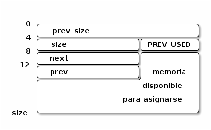

Administración de Memoria
=========================

Introducción
------------

Este documento detalla el manejo de la memoria dinámica en RTEMS. Para el usuario las principales API's a disposición son *Region Manager* y *malloc* de *newlibc*, los cuales utilizan internamente el sistema de *heaps* de RTEMS, al igual que el propio SO, para almacenar todas las estructuras de control.

*Heap*
------

Un *heap* en RTEMS es lo mismo que un *heap* en *libc* común, se asemeja particularmente a la implementación *dlmalloc* (sin arenas): un espacio contiguo de memoria donde se asignan bloques de tamaño variable. La estructura de los bloques (``blocks``) de ``malloc`` se representan en la estructura ``Heap_Block``, que respeta la misma configuración de *dlmalloc*:

* ``prev_size``: Tamaño del bloque previo, este valor es solo válido si el bloque previo está libre. De otra forma no tiene validez y puede ser utilizado por el bloque anterior como parte del mismo, para reducir el *overhead*.

* ``size_and_flag``: Tamaño del bloque actual más un indicador (el LSB, bit menos significativo) que indica si el bloque previo está siendo usado (bit en 1) o no (bit en 0). Como los tamaños son siempre múltiplo de dos el último bit (LSB) no es necesario, por esta razón se lo puede utilizar con otro fin.

* ``next``: Puntero al próximo bloque libre. Este campo es solo válido si el bloque está libre, sino es parte del area reservada.

* ``prev``: Puntero al bloque libre anterior. Al igual que ``next`` solo es válido si el bloque está libre.

La estructura de control del *heap*, ``Heap_Control``, no está bien documentada, pero los atributos principales son:

* ``free_list``: Lista de los bloques libres.
* ``area_begin``: Inicio del *heap*.
* ``area_end``: Fin del *heap* (no inclusivo).

En los comentarios y código de RTEMS, al referirse a **area** se están refiriendo a un *heap*, y **block** se refiere a un bloque de memoria asignado por ``malloc``.

Otros aspectos del *heap* que aparecen bastante (no investigados) son los mecanismos de protección y la recolección de estadísticas.

*Allocation*
------------

Dentro de un *heap* la asignación se hace mediante el algoritmo de *First-Fit* (primero que se acomoda), recorriendo la lista de bloques libres hasta encontrar uno con espacio suficiente para satisfacer el pedido. Si el tamaño del bloque sobrepasa el tamaño pedido este se divide, y la parte restante es reingresada a la lista como un nuevo bloque libre.

Cada vez que un bloque es liberado se une a cualquier bloque vecino que también esté libre.

``malloc``
----------

La función ``malloc`` provista por RTEMS es simplemente un envoltorio que utiliza la funcionalidad del *heap*. Durante la inicialización del BSP se llama a la función ``bsp_libc_init``, que inicializa el *heap* de RTEMS. Soporta llamadas reentrantes (mediante el *mutex*: ``_RTEMS_Allocator_Mutex``).

RTEMS *Workspace*
-----------------

Hay dos tipos de memoria: **RTEMS Workspace** (el área de trabajo de RTEMS) y el **C Program Heap**, ambos son *heaps*, con la misma mecánica descripta antes. El *RTEMS Workspace* es la memoria utilizada por RTEMS para asignar a estructras de control para objetos del sistema, principalmente durante la etapa de inicialización, como tareas (y sus pilas), semáforos, etc. El **C Program Heap** es el *heap* utilizado por ``malloc`` para asignar memoria.

La opción *CONFIGURE_UNIFIED_WORK_AREAS* permite unir ambos en un solo *heap*. La ventaja es que reduce el desperdicio de memoria permitiéndo utilizar toda la memoria al máximo para cualquier asignación. La desventaja es que en el caso de que la aplicación sufra un *heap overflow* (desbordamiento del *heap*) esto impactará en las estructuras de control de RTEMS.
