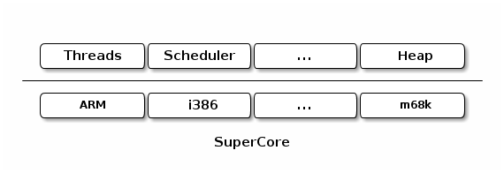

Relevamiento del Código Fuente de RTEMS - Parte II
**************************************************

.. _supercore:

SuperCore
=========

**SuperCore** es el *kernel* de RTEMS. Aquí se definen todos los objetos o
componentes básicos que son **independientes** de la arquitectura sobre la
cual se ejecuta RTEMS. Encima de él se implementan las diferentes APIs y
servicios que brinda RTEMS a las aplicaciones.

Dentro de *SuperCore* se pueden distinguir dos capas (ver figura de abajo). En
la primera, se encuentran los diferentes "objetos" que define (y que son
independientes de la arquitectura). La segunda, es **dependiente** de cada
modelo de CPU soportado. Esta segunda capa, se ocupa de cosas muy concretas,
como por ejemplo, inicializar el contexto de un *thread* y están expuestas en
forma de "primitivas" que son comunes a todas las arquitecturas.

En el directorio ``cpukit/score/src`` está el código de los componentes
**independientes** y en ``cpukit/score/src/cpu`` está el código
**dependiente** de la CPU, ordenado por modelo.

Componentes de **SuperCore**
----------------------------

Se pueden dividir los componentes del SuperCore en los siguientes grupos:

.. toctree::
   :maxdepth: 1

   01-basic-components.rst
   02-thread-management.rst
   03-thread-scheduling.rst
   04-memory-management.rst
   05-misc-components.rst
