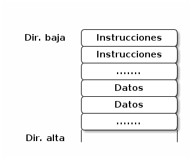
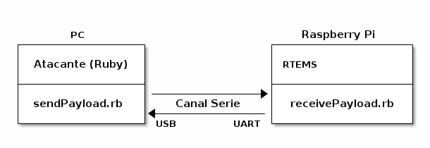

Desarrollo de *payloads*
========================

Se creó un *framework* para desarrollar en forma sencilla *payloads* para probar la explotabilidad de RTEMS.

*Framework* para Generar *Payloads*
===================================

El *framework* actual se separa en dos capas:

Capa-1: Funciones independientes que generan instrucciones ARM 32 bits configurables según los parámetros que se les pasan (``utils.rb``).

Capa-2: Clase ``MyCustompayload`` (``MyCustompayload.rb``) que utiliza estas funciones para construir *payloads* con lógicas más complejas, por ejemplo, utilizar las funciones de ``Load`` y ``Store`` en memoria para generar un ``memcpy``.

La Capa-1 cubre las funciones básicas: saltos de ejecución (B, BL, BLX), procesamientos de datos (MOV, CMP, ADD, SUB, etc.) y carga/almacenamiento de memoria (LDR, STR, LDM y STM).

La Capa-2 "empaqueta" estas instrucciones junto con datos en una lógica coherente para crear un *payload* con una funcionalidad específica. Las funciones ya no son independientes entre sí (por ejemplo, un salto a una etiqueta debe saber cuantas instrucciones hay entre la etiqueta y la dirección que ejecuta el salto, para calcular correctamente la distancia).

La estructura básica de un *payload* estaría dada como:

Funcionalidades Implementadas
-----------------------------

* Copia de memoria: Se realiza *word-by-word* (de a 4 bytes a la vez).

* Búsqueda de cadenas: Busca cadenas de *words* (4-bytes) en la memoria.

* Búsqueda de funciones: Busca funciones en memoria utilizando la búsqueda de cadenas, para detectar cadenas de instrucciones ("huellas", almacenadas en ``fingerprints.rb``) pertencientes a las funciones o datos cercanos que sirvan como referencia (pivot) y se pueda asumir con cierta seguridad que su distancia a la función deseada no varía.

Se guardan las direcciones de las funciones buscadas en un vector en memoria para luego poder ser llamadas por este *payload* o *payloads* de etapas avanzadas.

Ejecución remota de funciones (versión prelimiar): Ejecuta funciones junto con los parámetros que se le adjuntan cuyos datos se pasan por serie.

Limitaciones
------------

Hay algunos datos (direcciones) que por ahora deben ser conocidos de antemano para que los *payloads* funcionen:

* Dirección de retorno del *exploit*: Dirección que fue sobreescrita por el *exploit* (generalmente el LR apilado) a donde iba a retornar la función (en el caso de un *buffer overflow*). Por definición, este dato nunca va a ser accesible por el *payload* porque para que este controle el flujo de ejecución, la dirección de retorno se debe sobreescribir.

* Dirección de un área segura de memoria: Dirección "segura" de memoria donde se puedan almacenar datos referentes al *payload* (o los mismos *payloads* de otras estapas). Por "segura" se entiende que se pueda suponer con cierta confianza que no afecte el funcionamiento normal del programa y tampoco sea sobreescrito por algún otro *thread* (por ahora se usa la sección de BSS).

* Dirección del *buffer* (en caso de un *buffer overflow*): La mayoría de los *branchs* se hacen relativos al PC por lo que es necesario no solo saber la dirección destino sino también la direccion de origen para calcular correctamente el salto. Este dato podría (no se verificó con seguridad) omitirse si se agregara más complejidad al *payload* (particularmente el sistema de llamado de funciones).

No hay una abstracción de las instrucciones agregadas en el *payload*, en el sentido de que una instrucción son simplemente 4 bytes agregados al *payload*, de los que luego ya no se tienen ningún tipo de referencia ni control y no se pueden modificar. Se podría pensar como un esamblador de una sola pasada (a diferencia de ensambladores típicos que hacen dos o más). Se debería armar el *payload* en dos fases: la primera que agrege instancias de una clase "instrucción" al *payload*, y una segunda fase que recorra esas instrucciones del *payload* y termine de definir datos faltantes como referencias a otras instrucciones (etiquetas) o datos.

Un claro inconveniente de lo antes mencionado es que si una instrucción quiere cargar un dato del *payload* a un registro debe saber la distancia entre el PC y el dato requerido, para esto debe conocer cuantas instrucciones hay entre la misma y el dato (estas son instrucciones que todavía no se agregaron al *payload* y que el programa desconoce en el momento en que está codificando en bytes la instrucción actual).

Para solucionar este incoveniente debe ajustarse de antemano el tamaño de la sección de instrucciones (en la práctica se codifica el *payload* con un tamaño arbitrario, cuando se quiere construir el mismo se prodicirá un error indicando cuál es el tamaño final real y debe reajustarse el valor anterior y volver a ejecutar el script.)

El *payload* necesita saber *a priori* donde será colocado (de nuevo para calcular distancias entre el PC y por ejemplo una función externa que quiera llamar con un *branch*). En ARM es posible recuperar y/o modificar el valor del PC por lo que se podría agregar una lógica más elaborada para que el *payload* "descubra" su propia dirección cuando la necesita (y tal vez modificar sus propias instrucciones ajustándolas a esta dirección descubierta).

Ejemplos de *payloads*
======================

Se confeccionaron *payloads* de ejemplo para ilustrar tanto la funcionalidad del *framework* creado como también la forma de aprovechar una explotación exitosa de una vulnerabilidad en RTEMS, para la ejecución de código arbitrario.

Las pruebas están orientadas a la funcionalidad del *payload* (el código a ejecutar), no a la explotación de RTEMS (cómo introducir el código al sistema y ejecutarlo), del cual no se tiene ningún programa de un caso de uso real. Por tanto, los *payloads* se envían directamente a RTEMS, que los carga en memoria y los ejecuta (simulando una explotación que permita cargar y ejecutar código en forma remota).

La configuración del escenario de ataque es la siguiente:

Del lado derecho se encuentra RTEMS ejecutándose en una Raspberry Pi (RPi). Esta versión no tiene la funcionalidad TCP/IP habilitada y la única forma de conexión remota es por un canal serie, UART, expuesto en los pines Rx/Tx de la RPi.

Del lado izquierdo se encuentra el sistema que simula ser el atacante, implementado en una PC corriendo Ubuntu, donde la comunicación serie se implementa utilizando el chip CP2102 que convierte las señales UART a USB para conectarlo de manera sencilla a la PC.

Atacante
--------

En el directorio ``example/demos/`` se encuentran ejemplos básicos de *payloads* para probar el *framework* de desarrollo (``pthreadPaylaod.rb`` y ``evt_irq_corruption.rb``), junto con algunos archivos de soporte, que permiten la comunicación con RTEMS. Los ejemplos se encuentran escritos en Ruby (al igual que el *framework*).

El archivo ``sendPayload.rb`` se encarga de enviar el ejemplo (*payload*) seleccionado hacia RTEMS. El archivo ``listen.rb`` monitorea el puerto serie establecido con RTEMS y guarda todo lo recibido en el archivo ``serial.log``. El archivo ``common.rb`` contiene la configuración del puerto serie, siendo el dato más importante la dirección del mismo (en Ubuntu ``/dev/ttyUSB0``) que debe modificarse según la conexión y el OS utilizado (no es necesario modificar el resto de los parámetros si se conecta a la RPi, sí de correr RTEMS en otro dispositivo).

La versión de Ruby utilizada es 1.9.3 (debe ser mayora a la 1.8.x que está en los paquetes de Ubuntu, sino el código no va a funcionar, particularmente por el uso de la directiva ``require_relative`` que no está soportada en versiones anteriores).

RTEMS
-----

Se creó el programa de RTEMS ``receivePayload.c`` (ubicado en el mismo directorio mencionado antes), el cual básicamente espera recibir datos por el puerto serie, los carga a un *buffer* y los ejecuta como una función (simulando un *buffer overflow*).

Dado que no se encontró como crear y compilar correctamente programas de RTEMS, separados de los ejemplos provistos en el código fuente del mismo, siempre se trabaja sobre el ejemplo ``hello`` provisto por el código. Se edita su archivo ``init.c`` (``$HOME/development/rtems/src/git/testsuites/samples/hello/init.c``) y se compila este como se muestra en la sección sobre cómo ejecutar RTEMS. Por tanto, para poder utilizar ``receivePayload.c`` hay que vincularlo a `init.c`` (o sobreescribir los contenidos de un archivo con otro).

El archivo ``receivePayload.c`` contiene la función ``vulnFunc`` que es la función que simula tener la vulnerabilidad, que contiene al *buffer* donde se carga y se ejecuta el *payload* enviado por serie.

Para simplificar el trabajo se asumió (y esto se plasmó en el ejemplo) que todas las tareas que corren en RTEMS fueron creadas con la POSIX API, por lo que se tienen POSIX *threads* (hilos de ejecución). El programa inicia con la función ``Init`` (como todos los ejemplos de RTEMS), el cual crea un POSIX *thread* al que se lo denomina *thread* principal en este ejemplo, simulando correr la aplicación principal para la cual se lo creó. Este *thread* principal llama a ``vulnFunc`` donde se carga y ejecuta el *payload* recibido, luego de lo cual retorna al *thread* principal.

La comunicación serie se implementa en la función función ``readBytes``, que recibe como argumento la dirección de memoria donde copiar los datos recibidos por serie, utilizando tramas con el formato:

        || Preludio ("AAAA") | Largo de datos | Datos | Checksum ||

Se recomienda no modificar el archivo ``receivePayload.c`` (al menos no antes de la primera prueba) dado que los *payloads* de ejemplo tienen varias direcciones fijas escritas a mano referidas al programa de RTEMS, que de modificarse el archivo podrían variar, causando un error en los ejemplos (y siendo necesario reconfigurar estas direcciones).

Ejemplos
--------

Los ejemplos codificados al momento siguen la siguiente estructura lógica: son separados en dos etapas que se envían en distintos momentos, la primera etapa (*etapa-0*) es la que se "inyecta" al *buffer* y toma el control de la ejecución, luego de lo cual se queda esperando por serie a que se envie la segunda etapa (*etapa-1*) la cual copia a memoria (ya no al *buffer*), esta segunda etapa es la que contiene el código de interés para ser ejecutado.

La base lógica para realizar esta separación es que los *payloads* inyectados deben ser lo menos intrusivos posibles, por lo que la *etapa-1*, que tiene la mayor parte de la lógica, se ejecuta por separado (generalmente en un *thread* aparte creado por la *etapa-0*).

Hay algunas consideraciones a tener en cuenta. La primera, ya mencionada antes, es que los ejemplos requieren conocimiento previo del programa donde se los va a inyectar (principalmente direcciones de memoria y funciones), de no tenerlas fallará el ataque. Estos datos están señalizados al principio de los ejemplos para ser tenidos en cuenta en caso de que sea necesario modificarlos.

La *etapa-0*, que necesita comunicarse por serie con el atacante para recibir la *etapa-1*, utiliza por simplicidad la propia función del programa de ejemplo de RTEMS para efectuar la comunicación, ``receivePayload.c``, en vez de tener codificada esta funcionalidad dentro del propio *payload*.

Se implementó la funcionalidad para recorrer la memoria del programa de RTEMS para encontrar las funciones que sean requeridos por los *payloads* inyectados, nuevamente por simplicidad solamente la *etapa-1* contiene esta funcionalidad, mientras que la *etapa-0* necesita saber de antemano las direcciones de las funciones que quiera ejecutar.

Dado que la comuniación es serie, hay un único canal de comunicación (a diferencia de TCP/IP donde se pueden establecer varios canales lógicos por separado). Por lo tanto el canal debe estar libre para que funcionen correctamente los ejemplos, debiendo ser necesario tener cuidado con los mensajes que imprima el programa de RTEMS por consola, que también son transmitidos por serie.

A continuación se listan los ejemplos codificados hasta el momento.

``pthreadPayload.rb``
~~~~~~~~~~~~~~~~~~~~~

Este ejemplo demuestra cómo poder crear un *thread* paralelo al *thread* principal, de manera de poder ejecutar código perturbando lo menos posible la ejecución normal del programa de RTEMS.

La *etapa-0* (inyectada en el *buffer* de la función vulnerable ``vulnFunc``) se queda esperando por serie a que el atacante le envie la *etapa-1*, la cual copia a memoria y crea un *thread* para ejecutarla, retornando finalmente el control de ejecución al *thread* principal.

La *etapa-1* recorre la memoria para buscar las funciones que va a necesitar (almacenadas en ``fingerprints.rb``). Luego se queda esperando a recibir del atacante direcciones de funciones a ejecutar (junto a sus parámetros), las cuales son enviadas a través del canal serie.

``evt_irq_corruption.rb``
~~~~~~~~~~~~~~~~~~~~~~~~~

Este ejemplo demuestra como se puede corromper la tabla de interrupciones de ARM, almacenada en la dirección 0x0 de memoria, aprovechándo explotaciones de accesos de memoria a direcciones con valor nulo (*NULL*).

La *etapa-0* al igual que en el ejemplo anterior recibe y almacena a la *etapa-1* en memoria. Además de esto modifica el *handler* (manejador) de la excepción correspondiente a las interrupciones normales (IRQ) para que apunte a la *etapa-1*, convirtiéndola efectivamente en el *handler* de IRQ para el sistema operativo.

La *etapa-1*, para mantener funcionando correctamente el programa de RTEMS redirije las iterrupciones IRQ al *handler* original (que fue sobreescrito por la *etapa-0*). La idea es que antes de hacer la redirección evalúe alguna condición particular (por ejemplo el tipo de IRQ) para tomar una acción distinta a la que se tomaría normalmente.

A diferencia del ejemplo anterior donde la ejecución de código arbitrario se logra explícitamente mediante la creacion de un *thread* que está corriendo continuamente en RTEMS, en este caso se logra el control del programa cada vez que se dispara una interrupción permitiéndo ejecutar código (o no) según las condiciones indicadas.

En este ejemplo particular la *etapa-1*, para ilustrar el punto mencionado antes, simplemente aumenta un contador en memoria antes de redirigir la interrupción al *handler* correspondiente. Una vez que el contador llega a un número predeterminado (en este ejemplo 10000) imprime por consola un mensaje para señalizar la ejecución de código arbitrario en la interrupción (redirigiendo luego la ejecución al *handler* original). En este caso la condición de modifiación en el flujo normal de ejecución fue generada artificialmente con el contador mencionado, pero se hace notar nuevamente que podría estudiarse cualquier característica del sistema para tomar la decisión de ejecutar el código del *payload*.

Este ejemplo puede fallar ocasionalmente porque no es recomendable llamar a una función que imprime por consola estando el procesador en el modo de interrupción, considerando que la propia función generará nuevas interrupciones al realizar la escritura (y el modo interrupción está diseñado para ejecutar el menor código necesario que sea posible). De todas formas se deja así porque era la manera más sencilla de señalizar la ejecución de código arbritrario inyectado por el atacante, y en las pruebas se verificó que el ejemplo funcionaba (aunque no sea el 100% de las veces).

Procedimiento para ejecutar y comprobar un ejemplo
--------------------------------------------------

Se supone que se tiene una configuración como la descripta en esta documentación: un RTEMS corriendo en una RPi con una segunda RPi para realizar la interfaz entre el JTAG de la primera RPi y GDB que se ejecuta en la máquina de desarrollo que simula ser el atacante.

Primero se comienza examinando la comunicación serie con el archivo ``listen.rb`` que registrara todos los datos recibidos por serie en el archivo ``serial.log``, que debe ser monitoreado en forma continua.

Luego se conecta GDB a la RPi de depuración, que contiene OpenOCD, y se carga el programa de ejemplo de RTEMS ``hello`` (esto se explica en la sección de como correr RTEMS con JTAG).

Por el puerto serie, monitoreado por el programa en Ruby deberá aparecer:

.. code-block:: bash

    *** START VULN ***

Esta leyenda, enviada por el programa de RTEMS, indica que se llegó correctamente a la función vulnerable y se está esperando por el puerto serie que se envíe el *paylaod* a ejecutar.

A veces puede fallar la primera carga del programa y es necesario volverlo a cargar nuevamente (no se pudo determinar exactamente la razón) hasta ver la leyenda anterior.

Una forma de verificar si el programa falló por alguna razón indeterminada, es frenar la ejecución del programa en GDB y ver si está en la funcíón ``_Terminate``, función utilizada por RTEMS para terminar la ejecución del programa (quedándose corriendo un *loop* infinito), ya sea de forma exitosa o porque sucedió un error.

Para determinar si la razón de finalización fue un error debe correrse el comando ``backtrace`` y revisar si la función ``_Terminate`` fue llamada por la función ``rtems_fatal`` que es la forma más común que tiene RTEMS de terminar la ejecución en caso de algún error.

.. code-block:: bash

    Program received signal SIGINT, Interrupt.
    0x0001089c in _Terminate (the_source=the_source@entry=RTEMS_FATAL_SOURCE_EXCEPTION,
        is_internal=is_internal@entry=false, the_error=3852464152)
        at ../../../../../../rtems-git/c/src/../../cpukit/score/src/interr.c:52
    52    _CPU_Fatal_halt( the_error );
    (gdb) backtrace
    #0  0x0001089c in _Terminate (the_source=the_source@entry=RTEMS_FATAL_SOURCE_EXCEPTION,
        is_internal=is_internal@entry=false, the_error=3852464152)
        at ../../../../../../rtems-git/c/src/../../cpukit/score/src/interr.c:52
    #1  0x0000f96c in rtems_fatal (source=source@entry=RTEMS_FATAL_SOURCE_EXCEPTION,
        error=<optimized out>)
        at ../../../../../../rtems-git/c/src/../../cpukit/sapi/src/fatal2.c:34
    #2  0x000159cc in _ARM_Exception_default (frame=<optimized out>)
        at ../../../../../../../../rtems-git/c/src/../../cpukit/score/cpu/arm/\
        arm-exception-default.c:24
    #3  0x00013504 in save_more_context () at ../../../../../../../../rtems-git/c/\
        src/../../cpukit/score/cpu/arm/armv4-exception-default.S:142
    Backtrace stopped: previous frame identical to this frame (corrupt stack?)

De no fallar se envía el *payload* desde el atacante a la RPi con RTEMS mediante la conexión serie con el *script*:

.. code-block:: bash

    sudo ruby sendPayload.rb

Este archivo contiene en sus primeras líneas la lista de ejemplos disponibles (los cuales se acceden con el comando ``require_relative`` de Ruby). Debe seleccionarse únicamente uno solo de ellos (dejando el resto comentados). En este caso se utiliza el ejemplo ``pthreadPayload.rb``.

.. code-block:: ruby

    # Seleccionar uno de los payloads y comentar el resto

    require_relative "pthreadPaylaod"
    # require_relative "evt_irq_corruption"

Mostrará la salida:

.. code-block:: bash

    Enviando etapa-0
    Enviado
    Enviando etapa-1
    Enviado
    Presionar Enter para enviar RPC

Indicando que se enviaron las dos etapas del payload del ejemplo, la primer etapa recibida por ``receivePayload.c`` y la segunda etapa recibida por la primera, que logró controlar la ejecución del programa.

El programa de RTEMS, monitoreado por ``listen.rb``, de recibir correctamente los datos mostrará la salida:

.. code-block:: bash

    *** START VULN ***
    LEYO EL PREAMBULO!!
    Leyo el len: 56
    Se leyeron todos los datos: 56 bytes
    LEYO EL PREAMBULO!!
    Leyo el len: 476
    Byte 100/476
    Byte 200/476
    Byte 300/476
    Byte 400/476

    *** END VULN ***
    mainThread!
    Preparado para ejecutar funcion.
    mainThread!
    mainThread!
    mainThread!
    mainThread!
    LEYO EL PREAMBULO!!
    Leyo el len: 20
    Preparado para ejecutar funcion.
    mainThread!
    mainThread!
    mainThread!
    LEYO EL PREAMBULO!!
    Leyo el len: 20
    mainThread!
    Preparado para ejecutar funcion.
    mainThread!
    mainThread!

Lo primero que se ve (luego del inicio de la función vulnerable) es el progreso del envío de datos (las dos etapas del *payload*), luego termina la función vulnerable (``*** END VULN ***``), lo que indica que la *etapa-0* copió la *etapa-1* a memoria y retornó el flujo a la ejecución normal, indicado por la leyenda ``mainThread!`` que se repite cada 2-3 segundos el *thread* principal de ejecución del programa de ejemplo de RTEMS.

Mientras tanto, en paralelo, corre el *thread* con la *etapa-1* inyectada, que imprime la leyenda ``Preparado para ejecutar funcion.`` (al haber solo un canal de comunicación todo se imprime por serie).

Al presionar ``Enter`` en la consola que ejeucta el ataque (``sendPayload.rb``) se envía la dirección de una función a ejecutar junto (con sus parámetros), interpretada y ejecutada por la *etapa-1*.

Las leyendas ``LEYO EL PREAMBULO!!`` y ``Leyo el len: 20`` indican la recepción de los datos de la función a ejecutar (enviada por serie al igual que el *payload*). Dado que la función a ejecutar en este ejemplo es simplemente ``rtems_task_wake_after``, que solo genera que el *thread* pause su ejeución durante una cierta cantidad de tiempo, no se tendrá ningún otro efecto perceptible más que esas leyendas. Sin embargo se puede observar el fin de la ejecución de la función cuando la *etapa-1* vuelve a imprimir ``Preparado para ejecutar funcion.``, esperando la siguiente función a ejecutar.
